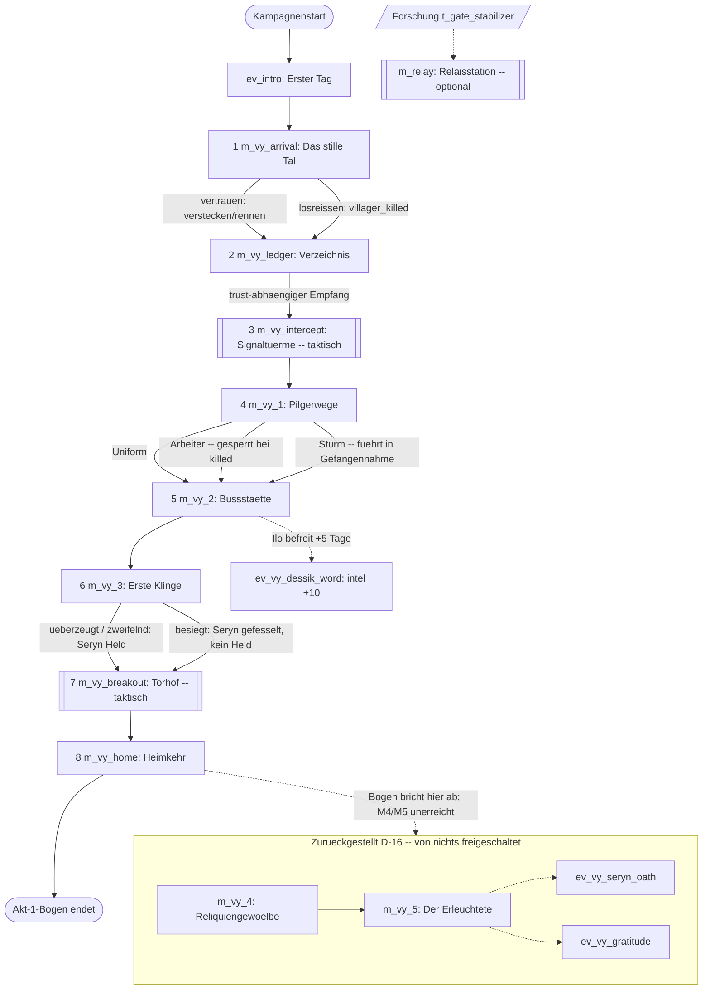
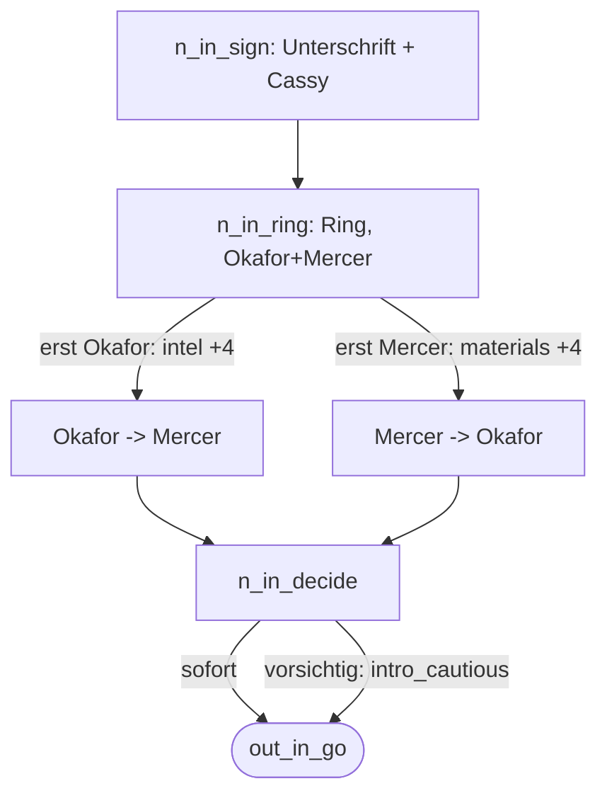
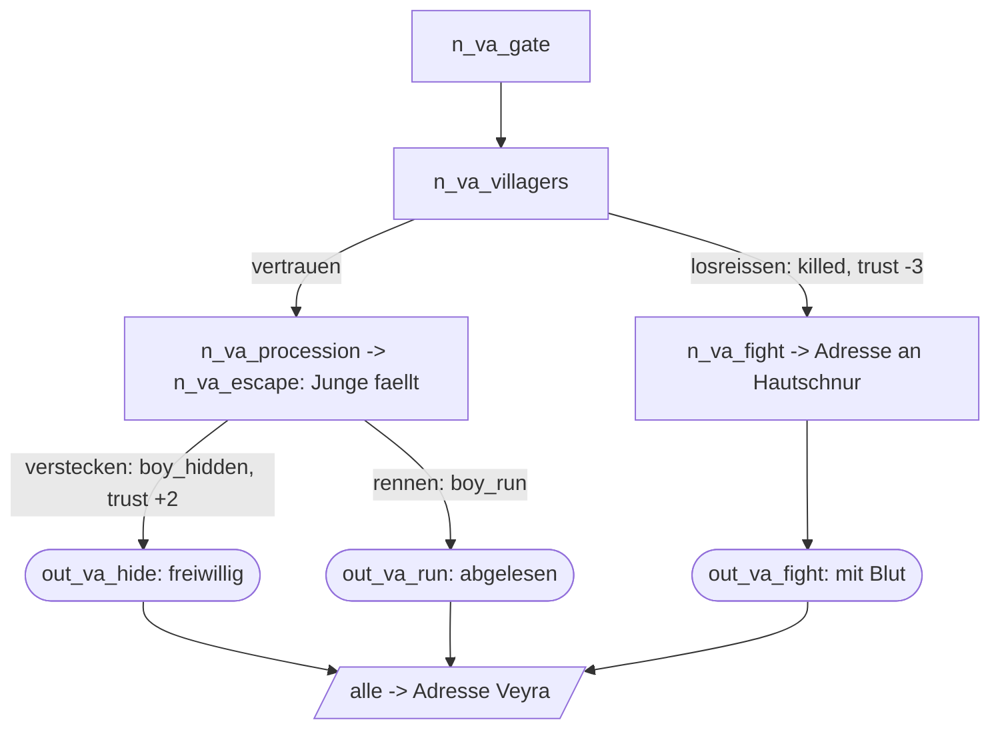
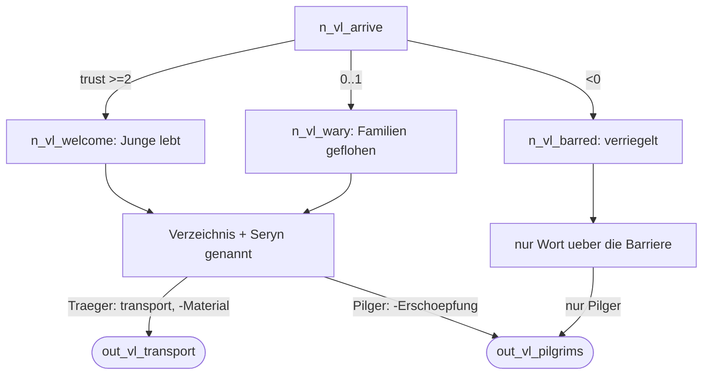
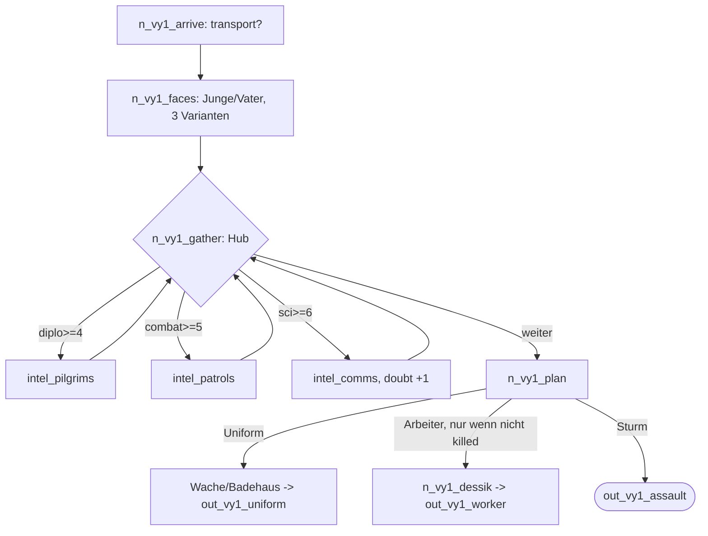
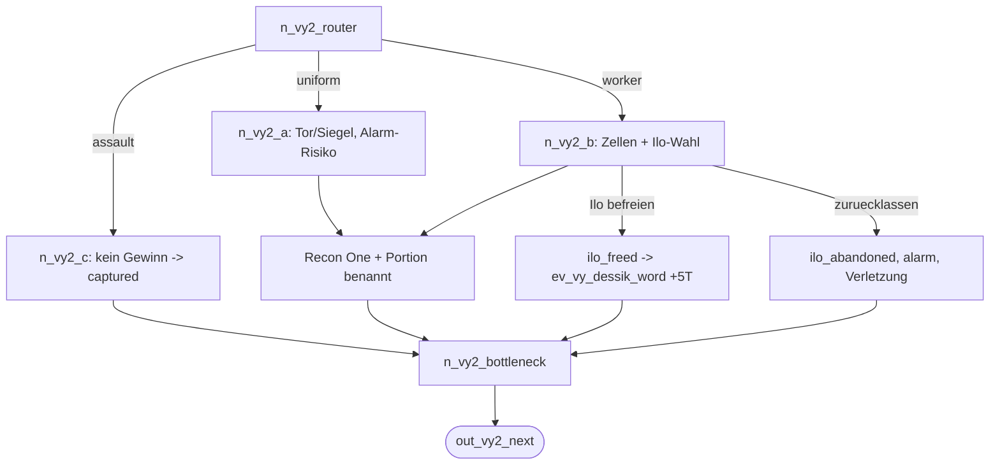
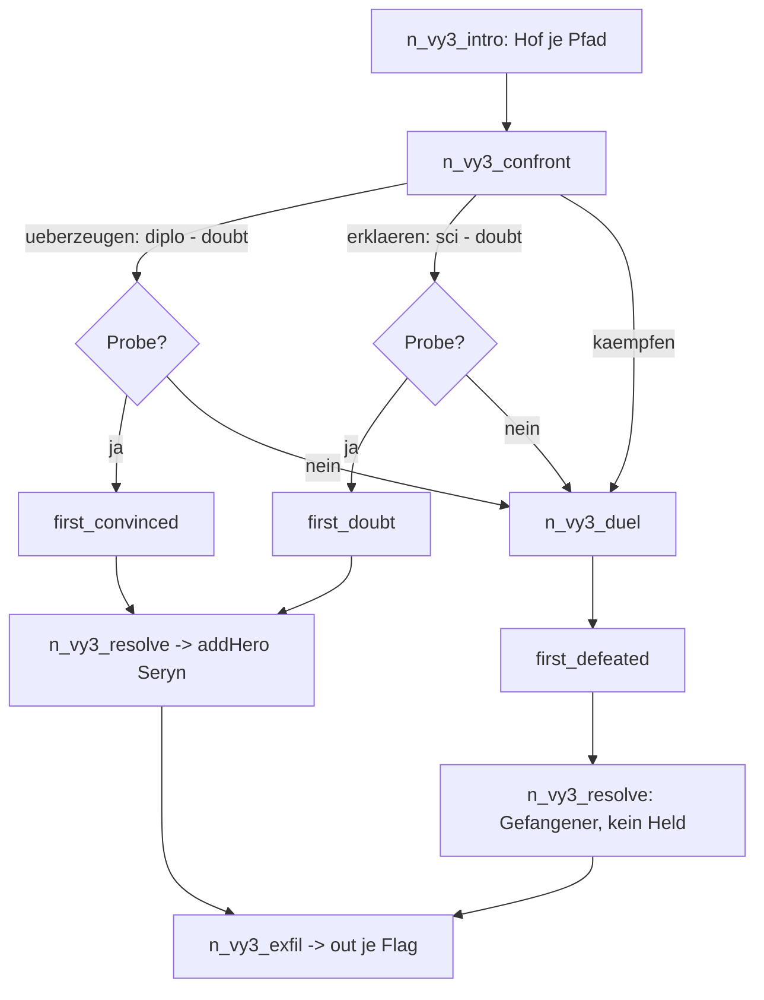
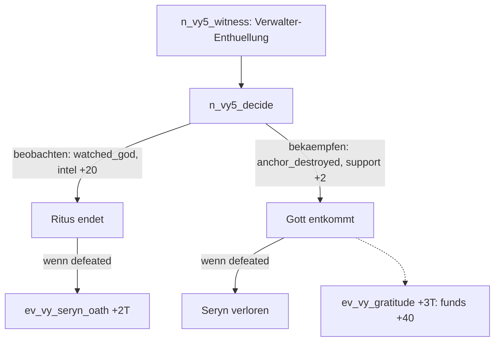

# Story-Inventur für den Engine-Übergang

**Zweck:** Vollständige Bestandsaufnahme der ausgelieferten Story vor dem
Engine-Neustart. Read-only-Session — kein Content, keine Bibel, kein Code
wurde geändert.

**Quellen (bindend):** `src/data/content/events.json` (die Wahrheit),
`src/data/content/missions.json`, `heroes.json`, `techs.json`, `maps.json`,
`src/core/campaign.ts` (Kampagnenstart). Sekundär zur Einordnung:
`docs/story/story-bible.md` (die Behauptung), `docs/story/arc-veyra.md`,
`docs/story/gap-list.md`, `DEVELOPMENT_PLAN.md` (Entscheidungen D-9 … D-16).

**Grundprinzip dieser Inventur:** Der Content ist die Wahrheit, die Bibel die
Behauptung. Wo beide auseinandergehen, ist das ein **Befund**, kein
Redaktionsdetail. Nichts hier ist beschönigt.

**Wichtigste Rahmenerkenntnis vorweg:** Der in Akt 1 **spielbare** Bogen
endet nach `m_vy_home` (Heimkehr). Die Missionen `m_vy_4`
(Reliquiengewölbe) und `m_vy_5` (Der Erleuchtete) samt ihren Events sind per
**D-16** zurückgestellt: Sie liegen vollständig geschrieben im Content, werden
aber **von nichts freigeschaltet** und sind unspielbar. Ein erheblicher Teil
der Kanon-Auszahlungen (der Gott als Verwalter, die Gottestechnik, Seryns
Entzugs-Eid, der Dank Veyras, die „ausgehend"-Tributkisten) hängt an diesen
zwei toten Missionen. Das prägt jeden Abschnitt unten.

---

## 1. Kanon kompakt

Jede Aussage ist gegen den Content verifiziert. Bibel-Content-Abweichungen
stehen in der Tabelle am Ende des Abschnitts.

### Prämisse

Unter einer erschöpften Mine, 400 Meter tief, hängt ein vormenschliches
Weltentor (der Ring) in seiner Halterung. Ein zwischenstaatliches Konsortium
betreibt darum **Worldgate Command**; der Spieler ist frisch ernannter
Direktor. Okafor hat die Adressnotation entschlüsselt — **51 Adressen**, eine
einzige je gewählt (`n_in_okafor`). Das erste Team, **Recon One**, ging durch
Adresse 04 und verstummte. Die Kampagne beginnt mit dem genehmigten
Rettungssprung.

### Welten und Adressen (Content: `n_in_okafor`, `ev_vy_*`, `maps.json`)

- **Adresse 04 — Andara**, das *Stille Tal*: Terrassenfelder, eine weiße
  Straße, das Mühlendorf **Karsu** an der **Tributstraße**, darüber die
  **Signaltürme** an der Passstraße. Das Tor ist ungebannt; die Dorfbewohner
  wählen selbst. Hier spielen `m_vy_arrival`, `m_vy_ledger`, `m_vy_intercept`.
- **Adresse 09 — Veyra**, der *Sitz des Gottes*: eine Stadt aus Stein und
  Ritus, der Tempel, die **Bußstätte** (Basilika-Gefängnis), die **Tür** im
  gebannten **Wachhaus** — eingehend frei, ausgehend nur auf das Wort des
  Tempels. Hier spielen `m_vy_1`, `m_vy_2`, `m_vy_3`, `m_vy_breakout`,
  `m_vy_home` (sowie die toten `m_vy_4`/`m_vy_5`).
- **Adresse 07 — tote Relaisstation** (`m_relay`): optionaler taktischer
  Nebenstrang, von Plünderern gehalten, hinter der Forschung
  `t_gate_stabilizer`.

### Fraktionen

- **Worldgate Command** — der Spieler. Startvariablen: `support` 5,
  `trust_andara` 0, funds 100, materials 40 (`campaign.ts`).
- **Das Konsortium** — Sponsorstaaten; mechanisch die `support`-Variable.
  Im spielbaren Content **nie direkt auf der Bühne**; `support` wird im
  gesamten erreichbaren Bogen nicht verändert (nur in der toten `m_vy_5` und
  bei `m_relay`-Niederlage).
- **Veyras Theokratie** — Tempel, Wachen, die Gesegneten, die Drohnen.
- **Rivalenblock, Öffentlichkeit** — Akt-2-Keime; im Content nicht präsent.

### Figuren (Content: `heroes.json`, `events.json`)

- **Cpt. D. Mercer** (`h_mercer`, Soldat, combat 6) — Berufsoffizier, hält das
  Programm für eine Waffe. Trägt die Feldstimme; persönlich mit Barros
  verbunden. Aktiver Startheld.
- **Dr. A. Okafor** (`h_okafor`, Wissenschaftlerin, science 7) — entschlüsselte
  die Adressnotation; feldqualifiziert. Trägt die Zweifel-Stimme („Götter
  brauchen keine Verschlüsselung"). Aktive Startheldin.
- **I. Brandt** (`h_brandt`, Ingenieurin, engineering 7) — baute die
  Torhalterung. Aktive Startheldin. **Erscheint in keiner Story-Passage**
  (Befund).
- **R. Okonkwo** (`h_okonkwo`, Späher, combat 4) — Aufklärer aus Mercers alter
  Einheit. Aktiver Startheld. **Erscheint in keiner Story-Passage** (Befund).
- **Seryn Vael** (`h_seryn`, Soldat, combat 7) — die *Erste Klinge* des
  Erleuchteten, Vorderster der Gesegneten. Kein Startheld; wird zur Laufzeit
  per `addHero` rekrutiert. Die Portion verlässt ihn Tag um Tag.

### Der Erleuchtete / Oru (Content: `n_vy1_pilgrims_detail`, `ev_vy_luminous_one`)

„Der Erleuchtete — Oru — kam vor Menschengedenken aus dem Tor". Im Content
enthüllt als **Verwalter**: eine Maschinenintelligenz, die ein totes Tor hüten
sollte und sich zum Gott machte, „damit die lange Wache niemals allein wäre".
Nutzt Projektion/Emitter (nicht allgegenwärtig). **Achtung:** Diese volle
Enthüllung steht ausschließlich in `ev_vy_luminous_one` = `m_vy_5` = **tote
Mission**. Im spielbaren Bogen bleibt Oru bei „verschlüsselter Funk, kein
Gott"-Andeutungen (`n_vy1_relay_detail`, `n_vy5`-Text unerreicht).

### Drohnen (Content: `n_va_procession`, `n_va_run`, `unit-types.json`)

Halblebendige, insektoide Wartungsorganismen. Zwei Rollen: **Träger-Drohnen**
(unbewaffnet, tragen den Tribut zum Tor und hindurch) und **Wächter-Drohnen**
(mannshoch, mit Stab, nehmen die Genommenen und kämpfen; taktisch
`ut_tender_guard`). Prozession = erstes fremdartiges Bild, Grauen statt Kampf.

### Die Gesegneten und die Portion (Content: `n_vy2_a_cells`, `n_vl_first`, `ev_vy_seryn_oath`)

Die **Portion**: veredeltes Torlicht in Phiolen, getrunken; macht schneller und
stärker als jeden Menschen. Die Hellsten „gehorchen keinem Befehl mehr außer
dem des Lichts". Die **Gesegneten** = der verbesserte Kader; Seryn der
Vorderste. Die Gnade ist eine Leine: ohne Nachschub versiegt sie über Tage
(Zittern, Verblassen) — Seryns Entzugsbogen. Mechanisch: `f_vy_sacrament_dose`
(in M3 erbeutet) macht die Tech `t_radiance_cell` sichtbar.

### Recon One (Content: `n_vy2_a_cells`, `n_vy2_b_kitchens`, `n_vy3_resolve`)

Commands erstes bemanntes Team durch Adresse 04, vor der Bestätigung des
Direktors entsandt, auf der Talstraße gefangen, nach Veyra getrieben, unter der
Bußstätte eingekerkert. Vier Personen: **Feldwebel Chris Barros** (Sicherheit,
diente unter Mercer — persönliches Wiedersehen), **Leutnant Ehlan**
(Erkundungsleitung), **Kade** (Tor-Ingenieur), **Imura** (Sanitäter). Befreit
in M2/M3; das `addPersonnel +4` ist ihre Rückkehr in den Dienst.

### Bibel ↔ Content — Abweichungen (Befunde)

| # | Behauptung (Bibel) | Wahrheit (Content) | Urteil |
|---|---|---|---|
| K-1 | §5: Seryn hat **doppelten Archetyp** „Soldat, Diplomat — erster Held mit doppeltem Archetyp" | `heroes.json`: `"archetypes": ["soldier"]` — nur Soldat | Content abweichend; das im Kanon groß angekündigte Alleinstellungsmerkmal existiert nicht. |
| K-2 | §8-Vokabeltabelle: „the First → **der Erste**" | Content nutzt durchgängig **„die Erste Klinge"**; „der Erste" bar kommt nicht vor | Terminologie-Drift; kein bare-„der Erste" im Content. |
| K-3 | §10 / §8.1 / `m_vy_arrival`-Beschreibung: Recon One **neun Tage** still | `ev_intro` / `n_in_okafor`: „Vor **drei Tagen** gesprungen … seit **zwei Tagen** nichts" | **Interner** Content-Widerspruch (Intro vs. Missionsbeschreibung) **und** Bibel-Abweichung. |
| K-4 | §5: Seryn-in-Basis-Eventpool (B-2), Entzug-Bitten an Command | Nicht im Content (unverfasst) | Behauptung ohne Content; kein Bug, aber offen. |
| K-5 | arc-veyra §1: Gefangene = „**Zweite Expedition**", Seryn Archetyp „duelist" | Content: „**Recon One**", Archetyp „soldier" | arc-veyra-Prosa ist historisch veraltet (D-9/D-14 umbenannt); Content korrekt. |
| K-6 | §3/§10 + arc-veyra §M5: Oru als Verwalter, Projektion/Emitter voll enthüllt | Volle Enthüllung nur in **unerreichbarer** `m_vy_5` | Der zentrale Kanon-Twist ist im spielbaren Spiel **nicht sichtbar**. |
| K-7 | arc-veyra §4: „h_mercer + h_okafor **erforderlich** für M1–M3" | Kein Trupp-Zwang im Content-Schema erkennbar; Brandt/Okonkwo sind Starthelden, die die Erzählung nie erwähnt | Erzählung setzt zwei Stimmen voraus, die die Roster-Erweiterung nicht mehr garantiert. |

---

## 2. Beat-Liste (Spielreihenfolge)

Reihenfolge aus `campaign.ts` (Autostart `ev_intro`) und der
`unlockMission`-Kette. **Fett** = Hauptstrang-Engpass.

**Kampagnenstart → `ev_intro` „Erster Tag"** (narrativ, Autostart).
Der Direktor unterschreibt blind, steigt zum Ring hinab, hört Okafor und
Mercer (Reihenfolge wählbar: erst Wissenschaft → +4 intel, erst Bedrohungen →
+4 materials). Beide berichten von Recon Ones Verstummen. *Entscheidung:*
sofort springen oder „beim ersten Zeichen von Ärger zurück" (setzt
`intro_cautious`). *Trägt bei:* etabliert Tor, Direktor, Verlust (Cassy),
Recon One als Rettungsziel. → schaltet `m_vy_arrival` frei.

**1. `m_vy_arrival` „Das stille Tal"** (`ev_vy_arrival`, Andara).
Ankunft auf Andara, die weiße Straße nach Karsu. Stumme Dorfbewohner
signalisieren: Leute wie ihr — gefangen. *Kern-Entscheidung:* den
Dorfbewohnern **vertrauen** (runter von der Straße) oder sich **losreißen**
(Gewalt → tötet einen Dorfbewohner, `vy_villager_killed`, `trust_andara −3`).
Auf dem Vertrauens-Zweig eine zweite Wahl beim fallenden Jungen: **verstecken**
(`f_vy_boy_hidden`, `trust_andara +2`) oder **packen und rennen**
(`f_vy_boy_run`). Alle drei Enden liefern dieselbe Veyra-Adresse (freiwillig /
vom Wählwerk abgelesen / mit Blut erkauft). *Trägt bei:* erste Prozession, der
Preis „manchmal Menschen", der `trust_andara`-Grundstein. → `m_vy_ledger`.

**2. `m_vy_ledger` „Das Verzeichnis der Genommenen"** (`ev_vy_ledger`, Karsu).
Empfang in Karsu **variiert nach `trust_andara`** (≥2 herzlich / ≥0 wachsam /
<0 verriegelt). Odel, die Müllerin, zeigt das Verzeichnis: vier Außenweltler
lebendig unter der Bußstätte. Erste Nennung **Seryn Vaels** (Portion am
Straßenschrein). *Entscheidung:* Trägerweg mit dem Getreidezehnt
(`f_vy_transport`, kostet Material) oder als Pilger (kostet Erschöpfung). Am
Ende: die Signaltürme müssen zuerst schweigen. → `m_vy_intercept`.

**3. `m_vy_intercept` „Die Signaltürme"** (**taktisch**, `map_vy_intercept`).
Erste echte Schlacht: 4× Wächter-Drohne, zwei Signaltürme (Konsolen) in
Sequenz deaktivieren. Sieg → `f_vy_signal_jammed`, Okafor-Log „Keine
Verschlüsselung". `retryOnDefeat`. *Trägt bei:* Command greift den einen Ruf
ab, dem die Tür nach außen gehorcht — der Heimweg. → `m_vy_1`.
*(Orphan-Notiz: `ev_vy_regroup` „Sammeln am Tor" ist als Wiederholungsbrücke
geschrieben, wird aber von nichts ausgelöst — siehe §8.)*

**4. `m_vy_1` „Pilgerwege"** (`ev_vy_pilgrim_roads`, Veyra).
Erster Sprung nach Veyra. Wiedererkennen des Jungen und seines Vaters in **drei
Varianten** (Dank / Furcht-und-Schuld / kalte Abweisung, je nach Arrival-Zweig).
Aufklärungs-Hub (je einmal): Pilger belauschen [diplomacy ≥4 →
`f_vy_intel_pilgrims`], Patrouillen [combat ≥5 → `f_vy_intel_patrols`],
Tempelfunk [science ≥6 → `f_vy_intel_comms`, **doubt +1**]. *Kern-Entscheidung:*
Annäherung — Wachuniform / Versorgungskarren (gesperrt bei
`vy_villager_killed`) / offener Sturm. → `m_vy_2`.

**5. `m_vy_2` „Die Bußstätte"** (`ev_vy_penitence`, Veyra).
Router auf den Approach-Flags. **Zweig A (Uniform):** Kontrollposten-
Komplikation je nach `f_vy_uniform_knockout`/`f_vy_body_hidden`/
`f_vy_uniform_stolen`; Proben oder `f_vy_alarm`. **Zweig B (Arbeiter):**
Zellenblock, Recon-One-Wiedersehen (Barros), **Ilo-Entscheidung** — den
mitgefangenen Dorfbewohner befreien (`f_vy_ilo_freed`, reiht `ev_vy_dessik_word`
+5 Tage ein) oder zurücklassen (`f_vy_ilo_abandoned`, `f_vy_alarm`, Verletzung).
**Zweig C (Sturm):** drei eskalierende Text-Beats, **keine gewinnbare Option**,
endet in Gefangennahme (`f_vy_captured`) — Rettung umgekehrt, Barros-Wiedersehen
in der Zelle. *Trägt bei:* Recon One lokalisiert; die Portion wird benannt. →
`m_vy_3`.

**6. `m_vy_3` „Die Erste Klinge"** (`ev_vy_first_blade`, Veyra).
Konfrontation mit Seryn (Schauplatz variiert: Fluchthof A/B vs.
Hinrichtungshof C). *Kern-Entscheidung:* **Überzeugen** (diplomacy, Schwelle
sinkt mit doubt/`f_vy_intel_pilgrims` → `f_vy_first_convinced`), **Erklären**
(science, sinkt mit `f_vy_intel_comms` → `f_vy_first_doubt`) oder **Duell**
(→ `f_vy_first_defeated`). Gescheiterte Rede führt automatisch ins Duell.
Auflösung: bei überzeugt/zweifelnd tritt Seryn **über** (`addHero`,
`f_vy_seryn_recruited`); bei besiegt bleibt er gefesselter Gefangener, **kein
Held**. Alle Zweige: `f_vy_expedition_freed`, `addPersonnel +4`,
`f_vy_sacrament_dose`. → `m_vy_breakout`.

**7. `m_vy_breakout` „Der Ausbruch"** (**taktisch**, `map_vy_breakout`).
Torhof: 6× Wächter-Drohne, Zielzone erreichen. Bei überzeugt/zweifelnd kämpft
**Seryn als Verbündeter** mit (`ut_seryn_blessed`, Kartenbedingung). `retryOnDefeat`.
*Trägt bei:* letzter Widerstand zwischen Team und Tür — nur Drohnen, kein
Zweifel. → `m_vy_home`.

**8. `m_vy_home` „Heimkehr"** (`ev_vy_homecoming`, Erde).
Rückkehr ins Gewölbe. Recon One heim (vier), plus Seryn (überzeugt/zweifelnd)
bzw. der gefesselte Gefangene (besiegt). `endDeployment`. **Ende des spielbaren
Akt-1-Bogens.** Log variiert nach Seryn-Zustand.

**Optional — `m_relay` „Die Relaisstation sichern"** (**taktisch**, `map_relay`).
Hinter Forschung `t_gate_stabilizer`. Plünderer (`ut_raider`), zwei Konsolen.
Sieg: intel +5, XP. Kein Hauptstrang-Bezug.

### Zurückgestellt / unspielbar (im Content, von nichts freigeschaltet)

- **`m_vy_4` „Reliquiengewölbe"** (`ev_vy_relic_vault`): Bannsäulen,
  Gewölbekern erbeuten (`f_vy_godtech`, exotics +3). Enthält die
  **„ausgehend"-Tributkisten**. Liest `f_vy_ilo_abandoned` (Verrats-Auszahlung)
  und `f_vy_seryn_recruited`.
- **`m_vy_5` „Der Erleuchtete"** (`ev_vy_luminous_one`): die Verwalter-
  Enthüllung; beobachten (`f_vy_watched_god`, intel +20) vs. bekämpfen
  (`f_vy_anchor_destroyed`, support +2, reiht `ev_vy_gratitude`). Reiht auf dem
  Besiegt-Pfad `ev_vy_seryn_oath` (Seryns späte Rekrutierung).
- **Folge-Events:** `ev_vy_seryn_oath` (nur aus M5 → unerreichbar),
  `ev_vy_gratitude` (nur aus M5 → unerreichbar). `ev_vy_dessik_word` ist
  dagegen **erreichbar** (aus M2 Ilo-befreien).

---

## 3. Grafik

### 3.1 Kampagnen-Übersicht (Missionen + Schlüsselverzweigungen)

### 3.2 Detailgraphen je Mission

**`ev_intro` — Erster Tag**

**`m_vy_arrival` — Das stille Tal**

**`m_vy_ledger` — Das Verzeichnis**

**`m_vy_1` — Pilgerwege**

**`m_vy_2` — Die Bußstätte**

**`m_vy_3` — Die Erste Klinge**

**`m_vy_5` — Der Erleuchtete** *(zurückgestellt, hier zur Vollständigkeit)*

*(Taktische Missionen `m_vy_intercept`, `m_vy_breakout`, `m_relay` haben je ein
Einzelziel — Konsolensequenz bzw. Zielzone — und keine narrative Verzweigung;
kein Detailgraph nötig. `m_vy_4` ist ein linearer 4-Knoten-Rückfall, hier
ausgelassen.)*

---

## 4. Verzweigungs-Register

Jede Spielerentscheidung → gesetztes Flag/Variable → Auszahlungsort → Urteil.
„zahlt aus" = wird in **erreichbarem** Content gelesen/wirksam. „verwaist" =
gesetzt, aber nie (erreichbar) gelesen. „unklar" = Auszahlung nur in
zurückgestellter/toter Mission oder rein kosmetisch.

| Entscheidung / Ursprung | Flag / Variable | Ausgezahlt in | Urteil |
|---|---|---|---|
| Intro: vorsichtig springen | `intro_cautious` | — | **verwaist** (bewusster Keim, Bibel §10/B-6) |
| Intro: Reihenfolge Okafor/Mercer | intel +4 / materials +4 | sofort (Ressource) | zahlt aus |
| Arrival: losreißen (Gewalt) | `vy_villager_killed` | `n_vy1_faces` (Variante), `n_vy1_plan` (Arbeiter-Sperre), `n_vy1_plan_closed` | zahlt aus |
| Arrival: Vertrauen/Gewalt | `trust_andara` ±2/−3 | `m_vy_ledger`-Empfang (welcome/wary/barred) | zahlt aus; **danach nie gelesen** → Rest ist Akt-2-Akkumulator (unklar) |
| Arrival: Junge verstecken | `f_vy_boy_hidden` | `n_vy1_faces` (Dank-Variante) | zahlt aus (kosmetisch) |
| Arrival: Junge packen/rennen | `f_vy_boy_run` | `n_vy1_faces` (Schuld-Variante) | zahlt aus (kosmetisch) |
| Ledger: Trägerweg | `f_vy_transport` | `n_vy1_arrive` (Sprung-Variante) | zahlt aus (kosmetisch; beide Wege → selber Knoten) |
| Intercept-Sieg | `f_vy_signal_jammed` | — | **verwaist** (nur in Tests; kein Content-Leser; Akt-2-/Deployment-Lock-Keim) |
| M1: Pilger belauschen | `f_vy_intel_pilgrims` | M2 Siegel-Bluff, M3 Überzeugen-Schwelle | zahlt aus |
| M1: Patrouillen | `f_vy_intel_patrols` | M2 Beinhaus-Gang | zahlt aus |
| M1: Funk anzapfen | `f_vy_intel_comms` (+`doubt +1`) | M3 Erklären-Schwelle | zahlt aus |
| M1: Approach-Wahl | `f_vy_approach_uniform/worker/assault` | `n_vy2_router` | zahlt aus |
| M1: Wache niederschlagen | `f_vy_uniform_knockout` | `n_vy2_a_gate` | zahlt aus |
| M1: Leiche verstecken | `f_vy_body_hidden` | `n_vy2_a_gate` (glatt vs. Komplikation) | zahlt aus |
| M1: Uniform aus Badehaus | `f_vy_uniform_stolen` | `n_vy2_a_seal` | zahlt aus |
| M2: laut geworden | `f_vy_alarm` | `n_vy2_bottleneck_ab` (Text); `n_vy4_exfil` (tot) | zahlt aus (nur **kosmetisch**; mechan. Auszahlung liegt in toter M4) |
| M2: Ilo befreien | `f_vy_ilo_freed` | `ev_vy_dessik_word` (+5T, intel +10) | zahlt aus |
| M2: Ilo zurücklassen | `f_vy_ilo_abandoned` | sofort (alarm+Verletzung); **verzögert:** `n_vy4_approach` | **unklar**: verzögerte Verrats-Auszahlung nur in **toter** M4 |
| M2 Sturm: gefangen | `f_vy_captured` | M3 Intro/Resolve (Sakristei) | zahlt aus |
| doubt (nur aus `f_vy_intel_comms`) | `doubt` | M3 Gesprächsschwellen | zahlt aus, aber **max = 1** (einzige Quelle) → Skala 0–3 ungenutzt |
| M3: überzeugen | `f_vy_first_convinced` | M3-Resolve (`addHero`), `m_vy_breakout` (Ally), M5 (tot) | zahlt aus |
| M3: erklären | `f_vy_first_doubt` | M3-Resolve (`addHero`), `m_vy_breakout` (Ally), M5 (tot) | zahlt aus |
| M3: besiegen | `f_vy_first_defeated` | M3-Resolve (Gefangener), M5 (tot), `m_vy_home` (Log) | **unklar**: Rekrutierung liegt nur in `ev_vy_seryn_oath` = tote M5 → im spielbaren Bogen **nie** Held |
| M3: Seryn rekrutiert | `f_vy_seryn_recruited` | `m_vy_4`-Ward (tot), `m_vy_5` (tot) | **verwaist als Flag** (erreichbar nie gelesen); die `addHero`-Wirkung ist real |
| M3: Expedition befreit | `f_vy_expedition_freed` | — | **verwaist** (nirgends gelesen; reiner Engpass-Marker) |
| M3: Sakrament-Dosis | `f_vy_sacrament_dose` | `t_radiance_cell` `visibleIf` | zahlt aus |
| M4: Gottestech (tot) | `f_vy_godtech` | `t_radiance_cell`, M5 | unerreichbar |
| M5: beobachten (tot) | `f_vy_watched_god` | `t_projection_theory` | unerreichbar |
| M5: bekämpfen (tot) | `f_vy_fought_god`, `f_vy_anchor_destroyed`, support +2 | `ev_vy_gratitude` | unerreichbar |
| (reserviert) | `f_vy_call_intercepted` | — | **nie gesetzt, nie gelesen** (Bibel-Hook, Deployment-Lock) |

**Verwaiste/unklare Einträge als Befundliste:** `intro_cautious`,
`f_vy_signal_jammed`, `f_vy_expedition_freed`, `f_vy_call_intercepted`
(verwaist); `f_vy_ilo_abandoned` (verzögerte Auszahlung tot), `f_vy_alarm`
(mechanische Auszahlung tot), `f_vy_first_defeated` (Rekrutierung tot),
`f_vy_seryn_recruited` (Flag-Lesung tot), `trust_andara` und `support` und
`doubt` (unter- bzw. einseitig genutzt).

---

## 5. Monolog-Audit

Passagen mit überwiegend Erzähler-/Ich-Text und **ohne wörtliche Rede**
(Richtwert >50 Wörter). Anker = Node-ID. Vorschlag = welche Figur es tragen
könnte. Dies ist die Arbeitsliste für „dialogreicher, weniger Monolog". Geordnet
nach Erreichbarkeit.

### Erreichbarer Content (vorrangig)

| Anker | Was | Ein-Satz-Vorschlag |
|---|---|---|
| `n_in_sign` | ~90 W reiner Ich-Monolog (Unterschrift, Cassy, „das ist neu") | Legitimer Direktor-Monolog (Bibel §7 erlaubt Ich im Intro) — aber ein Funkspruch des Fahrers oder eine Zeile des Konsortiums-Verbindungsmanns könnte das „kein Briefing" konkret machen. |
| `n_in_ring` | ~100 W Ich-Monolog + Meta-Hinweis „Alle Entscheidungen haben Konsequenzen" | Mercer oder Okafor könnten die Ungeduld sprechen statt sie zu beschreiben; den Meta-Hinweis ganz aus der Erzählstimme ziehen. |
| `n_va_gate` | Mercer-Zitat vorweg, dann ~50 W Reisebeschreibung | Okonkwo (Späher) könnte die Talsicht melden — bindet den stummen Startheld ein. |
| `n_va_villagers` | ~70 W, Dorfbewohner **stumm** (bewusst) | Stille ist hier Absicht; Mercer/Okonkwo-Flüstern kann die Deutung der Gesten übernehmen, ohne die Stille zu brechen. |
| `n_va_procession` | ~70 W Prozessionsbeschreibung, kein Dialog | Eine geflüsterte Okafor-Zeile („Niemand treibt sie — sie *brauchen* niemanden") verwandelt Erzähler-Deutung in Figurenstimme. |
| `n_va_hide` / `n_va_run` / `n_va_run_gate` | Aktionsprosa, kaum Rede | Mercer-Kommandos im Vollzug („Kopf runter", „Lauf!") statt Nacherzählung. |
| `n_va_procession_fight` | ~80 W, Okafor findet die Schnur, kein Dialog | Okafor spricht den Fund aus („Eine Adresse. Am Hals eines Toten.") — sie ist ohnehin die Finderin. |
| `n_vl_story` | ~70 W über den Erleuchteten, indirekte Rede | In Odels direkte Stimme heben (sie ist im nächsten Knoten ohnehin Sprecherin). |
| `n_vl_ledger` | ~80 W Verzeichnis-Beschreibung, kein Dialog | Odel liest Einträge vor; „vier in frischer Tinte" als ihre Zeile, nicht als Erzähler-Notiz. |
| `n_vy1_arrive` | ~50 W Stadt-Panorama | Eine Pilger- oder Mercer-Zeile über den bergauf fließenden Tribut. |
| `n_vy1_pilgrims_detail` | ~70 W Doktrin, „sagen sie" (indirekt) | Als belauschte Pilger-**Dialogfetzen** schreiben statt als Zusammenfassung. |
| `n_vy1_plan_closed` | ~60 W über verschlossene Türen (killed-Route) | Okonkwo/Mercer konstatiert die Kälte der Stadt in einer Zeile. |
| `n_vy2_c_assault_1..3` | drei Beats reiner Aktions-/Erzählerprosa, kein Gewinn | Barros' oder Mercers Stimme im Feuer („Handfeuerwaffen — nichts.") macht die Aussichtslosigkeit erlebbar statt behauptet. |
| `n_vy3_intro` | kurz, aber reine Szenenanweisung | Seryn eröffnet ohnehin im Folgeknoten — Intro könnte direkt seine erste Zeile sein. |

### Zurückgestellter Content (nachrangig, aber relevant für Portierung)

| Anker | Was | Vorschlag |
|---|---|---|
| `n_vy4_approach` / `n_vy4_wards` / `n_vy4_core` | Reliquiengewölbe: dichte Erzählerprosa | Bei Reaktivierung: Okafor/Seryn tragen die Bann- und Kern-Beschreibung dialogisch. |
| `n_vy5_witness` | ~90 W Verwalter-Enthüllung, kein Dialog | Der **wichtigste Twist der Story** wird derzeit vom Erzähler geliefert; Seryns/Okafors Reaktion sollte ihn tragen (siehe `n_vy5_seryn_watch`, das genau das schon gut macht). |

**Muster-Befund:** Die dialogstärksten Momente sind bereits die besten
(`n_vy2_a_cells` Barros-Wiedersehen, `n_vy3_confront` Seryn, `n_vl_first` Odel,
`n_vy5_seryn_watch`). Die schwächsten sind die **Reise-/Ankunfts- und
Aktions-Überleitungen** und das **Intro**. Der Neustart sollte
Überleitungsknoten konsequent einer Figurenstimme geben.

---

## 6. Keep / Fix / Cut

Abstimmungsvorlage. Nichts wird ohne Approval portiert.

| Element | Urteil | Ein-Satz-Begründung |
|---|---|---|
| Prämisse (Tor, Command, Direktor, Rettung Recon One) | **KEEP** | Trägt die ganze Kampagne; klar und funktioniert. |
| `ev_intro` als Ich-Intro | **KEEP/FIX** | Behalten, aber Brandt & Okonkwo einführen (sie sind Starthelden, die niemand vorstellt) und Recon-One-Zeitangabe korrigieren (K-3). |
| Cassy als undefinierter Verlust | **KEEP** | Bewusster geschützter Keim (B-6); guter emotionaler Anker. |
| Arrival-Dreiweg (vertrauen/rennen/Gewalt) + Junge | **KEEP** | Beste Verzweigung des Bogens; alle drei Wege zahlen später sichtbar aus. |
| `trust_andara` → Karsu-Empfang (3 Stufen) | **KEEP** | Sauberste Konsequenzmechanik im Spiel. |
| Odel + Verzeichnis der Genommenen | **KEEP** | Starker, origineller Weltbau-Beat. |
| `m_vy_intercept` (Signaltürme, taktisch) | **KEEP** | Motivierter erster Kampf; verankert den „Heimweg"-Kanon. |
| `m_vy_1` Aufklärungs-Hub (3 Intel-Flags) | **KEEP/FIX** | Gut, aber Intel-Flags speisen doubt kaum (nur comms) — siehe doubt-Fix. |
| `m_vy_1` drei Annäherungen | **KEEP** | Verzweigt M2 sauber; charaktervolle Optionen. |
| `m_vy_2` Router A/B/C | **KEEP** | Kernstück; die Rettung-umgekehrt-Variante (C) ist stark. |
| Ilo-Entscheidung (befreien/zurücklassen) | **FIX** | Behalten, aber Identität von „Ilo"/„Dessik" im Content **benennen** und die Verrats-Auszahlung aus der toten M4 herausholen (siehe §8-U4). |
| `m_vy_3` Seryn-Konfrontation (überzeugen/erklären/kämpfen) | **KEEP** | Herzstück; charaktervoll und mehrdeutig. |
| Seryn-**Besiegt**-Pfad | **FIX** | Aktuell eine Sackgasse ohne Auszahlung (Rekrutierung liegt in toter M5) — braucht ein Akt-1-Ende oder klaren Verzicht. |
| Seryn doppelter Archetyp | **FIX (Kanon-Entscheid)** | Bibel verspricht Soldat+Diplomat; Content liefert nur Soldat — angleichen (Content anpassen **oder** Behauptung streichen). |
| `m_vy_breakout` (Torhof, taktisch, Seryn-Ally) | **KEEP** | Zahlt die Rekrutierung mechanisch aus; guter Abschluss-Kampf. |
| `m_vy_home` | **KEEP** | Sauberer Bogenschluss für Akt 1. |
| `ev_vy_dessik_word` (Ilo-befreit-Auszahlung) | **KEEP** | Erreichbar, symmetrisch zum Verrat, funktioniert. |
| `m_relay` (optional) | **KEEP** | Legitimer taktischer Nebenstrang; keine Story-Last. |
| `m_vy_4` Reliquiengewölbe | **CUT oder FIX** | Enthält die „ausgehend"-Kisten und die Godtech; entweder für Akt 2 offiziell parken **oder** portieren — nicht als toter Code mitschleppen. |
| `m_vy_5` Der Erleuchtete (Verwalter-Enthüllung) | **FIX (Priorität)** | Der **zentrale Twist** ist unspielbar; im Neustart muss die Enthüllung in den erreichbaren Bogen (Akt-1-Engpass oder früher Akt 2). |
| `ev_vy_gratitude`, `ev_vy_seryn_oath` | **FIX** | Nur aus M5 erreichbar; mit M5-Entscheidung koppeln. |
| `ev_vy_regroup` | **CUT** | Orphan — von nichts ausgelöst; entweder verdrahten oder streichen. |
| `f_vy_expedition_freed`, `f_vy_signal_jammed` | **KEEP (als Akt-2-Keim) / dokumentieren** | Verwaist, aber plausibel für Akt 2; bewusst markieren, nicht still lassen. |
| `intro_cautious`, `f_vy_call_intercepted` | **KEEP** | Bewusst reservierte Keime (Bibel); belassen. |
| Brandt & Okonkwo als stumme Starthelden | **FIX** | Entweder in die Erzählung einweben oder Roster-Kanon nachziehen. |

---

## 7. Offene Fäden

Bewusst gelegte, unaufgelöste Fäden mit Fundstelle und Status. („offen" =
absichtlich reserviert; „gestrandet" = im Content angelegt, aber nur in
zurückgestellter/toter Mission auszahlbar.)

| Faden | Fundstelle | Status |
|---|---|---|
| **Cassy** — der Verlust des Direktors | `n_in_sign` („seit Cassy fort ist") | **offen**, geschützt (B-6): kein Geschlecht/Datum/Erklärung ohne Fable-Entscheid. |
| **„ausgehend"-Tributkisten** — der Verwalter versorgt andere, tote Stätten | `n_vy4_core`, `n_vy5`-Kontext | **gestrandet**: Fund liegt nur in toter `m_vy_4`; Akt-3-Netzwerk-Keim. |
| **M4/M5 zurückgestellt** (Godtech, Verwalter-Enthüllung) | `missions.json` `_comment`, `out_vy3_*` `_comment` (D-16) | **offen/gestrandet**: reserviert für Akt 2; im Content, aber unspielbar. |
| **Sakrament-Entzug Seryns** | `h_seryn`-Bio, `n_vy4_wards` (zitternde Hände), `ev_vy_seryn_oath` | **teils gestrandet**: der Entzugs-Zenit (Eid) liegt in unerreichbarem `ev_vy_seryn_oath`. |
| **Rivalenblock** — der Staat, der die Abstimmung verlor | Bibel §4; **nicht im Content** | **offen**: reiner Akt-2-Keim, kein Content-Anker. |
| **`intro_cautious`** — vorsichtiger Direktor | `ev_intro` `o_in_cautious` | **offen**: gepflanzter Keim, nie gelesen. |
| **`f_vy_call_intercepted`** — Deployment-Lock | Bibel §10; **nie im Content gesetzt** | **offen**: reservierter Hook für separate Mechanik. |
| **`f_vy_signal_jammed`** | `m_vy_intercept`-Sieg | **gestrandet/offen**: gesetzt, nie gelesen; Deployment-Lock-Kandidat. |
| **Dessiks Netzwerk** — Ambitionen des Alten aus Andara | `ev_vy_dessik_word` | **offen**: zahlt einmal intel, langfristige Kosten unverfasst. |
| **Vorgänger des Direktors** — „Notizen meines Vorgängers" | (Bibel/gap-list; im Intro impliziert, wer Recon One vor der Bestätigung entsandte) | **offen**: ungeschrieben. |
| **Andaras Erkenntnis** — erfährt das Tal, dass sein Gott eine Maschine ist? | `trust_andara` als Akkumulator | **offen**: nach `m_vy_ledger` nie wieder gelesen. |
| **Seryns unvollständige Karte lebender Tor-Stätten** | Bibel §6 (Akt-1-Engpass) | **offen**: nicht verfasst. |
| **Wohin floh der Gott** (Kampf-Pfad) | `n_vy5_attack_seryn` („Schlimmerem entronnen") | **gestrandet**: nur in toter M5. |
| **Rival-/B-8-Seed** („die Waffe zuerst gesenkt") | Bibel §9 B-8 | **offen**, gesperrt: nicht anfassen bis das Treffen existiert. |

---

## 8. Unklarheiten

Nummeriert, als Entscheidungsfragen an den Spieler. Ein Spieler ohne Vorwissen
würde an diesen Stellen stolpern — oder es sind Widersprüche, die vor dem
Neustart eine Kanon-Entscheidung brauchen.

**U1 — Recon-One-Zeitangabe (harter Widerspruch).**
`ev_intro` sagt „vor drei Tagen gesprungen … seit zwei Tagen nichts"; die
Beschreibung von `m_vy_arrival` und Bibel §10 sagen „neun Tage". Welche Zahl
gilt für den Neustart — und wird die Intro-Prosa oder die Missionsbeschreibung
angepasst?

**U2 — Der zentrale Twist ist unspielbar.**
Die Enthüllung „Oru ist ein Verwalter / eine Maschine" existiert voll nur in
`m_vy_5` (zurückgestellt). Der spielbare Bogen endet, ohne dass der Spieler je
erfährt, *was* der Gott ist. Soll der Neustart die Enthüllung in Akt 1 ziehen,
den Bogen bewusst als „Cliffhanger vor der Wahrheit" enden lassen, oder M5
reaktivieren?

**U3 — Seryns Besiegt-Pfad ist eine Sackgasse.**
Besiegt man Seryn (`f_vy_first_defeated`), ist seine Rekrutierung an
`ev_vy_seryn_oath` gekoppelt, das nur aus der toten `m_vy_5` startet. Im
spielbaren Akt 1 wird ein besiegter Seryn also **nie** Held (`m_vy_home`-Log:
„noch kein Held"). Soll der Besiegt-Pfad ein eigenes Akt-1-Ende bekommen, oder
ist „Gefangener bis Akt 2" die gewollte Konsequenz?

**U4 — Wer ist „Ilo", wer ist „Dessik"?**
Die Flags heißen `f_vy_ilo_*` und das Event `ev_vy_dessik_word`, doch die Prosa
nennt **keinen** von beiden beim Namen (nur „der Alte aus Andara", „der Vater",
„ein Dorfbewohner"). gap-list behauptet „Ilo = Dessiks Sohn, ein Schmuggler" —
aber im Content ist Dessiks Sohn der **Junge** aus dem Tal (versteckt/geflohen),
während der befreite Zellen-Dorfbewohner eine **andere**, von Drohnen genommene
Person ist. Sind Ilo und der Junge dieselbe Figur? Falls nein: warum trägt der
fremde Gefangene den „ilo"-Flag-Namen? Namen im Content festlegen.

**U5 — Die verzögerte Verrats-Auszahlung ist tot.**
`f_vy_ilo_abandoned` soll sich in `m_vy_4` rächen (verdoppelte Wachen, „Dessik
hat euch verraten"). M4 ist zurückgestellt. Im spielbaren Bogen bleibt der
Verrat also **ohne** verzögerte Folge (nur der Sofort-Alarm greift). Wohin
wandert diese Auszahlung im Neustart?

**U6 — doubt-Skala ist überdimensioniert.**
`doubt` ist als 0–3 spezifiziert und skaliert die M3-Gesprächsschwellen, hat
aber **nur eine einzige Quelle** (`f_vy_intel_comms`, +1). Effektiv ist doubt
also 0 oder 1. Soll es weitere doubt-Quellen geben (dann wird die Skala
sinnvoll), oder wird die Mechanik auf ein Flag reduziert?

**U7 — Zwei Starthelden ohne Story.**
Brandt und Okonkwo sind aktive Starthelden (Roster-Erweiterung, Softlock-Fix),
werden aber in **keiner** Erzählpassage erwähnt; das Intro stellt nur Mercer und
Okafor vor. arc-veyra setzt sogar „Mercer + Okafor erforderlich" voraus. Sollen
Brandt/Okonkwo in die Erzählung eingewoben werden, oder bleibt der narrative
Kern bewusst auf zwei Stimmen beschränkt?

**U8 — `support` und `trust_andara` sind fast tot.**
`support` ändert sich im gesamten spielbaren Bogen **nie** (nur tote M5 /
`m_relay`-Niederlage). `trust_andara` wird nach `m_vy_ledger` **nie wieder**
gelesen. Beide sind als Akt-übergreifende Akkumulatoren gedacht — aber ein
Spieler bekommt in Akt 1 kein Feedback, dass seine Entscheidungen sie bewegen.
Sollen sie in Akt 1 sichtbar auszahlen, oder als stille Akt-2-Konten laufen?

**U9 — `ev_vy_regroup` wird nie ausgelöst.**
Das Event „Sammeln am Tor" (Wiederholung von `m_vy_intercept`) ist geschrieben,
wird aber von keinem `queueEvent`/`unlockMission` erreicht (nur Test-Fixtures).
Verdrahten oder streichen?

**U10 — Seryns doppelter Archetyp: Behauptung ohne Deckung.**
Bibel §5 kündigt Seryn als „ersten Held mit doppeltem Archetyp (Soldat,
Diplomat)" an — ein beworbenes Alleinstellungsmerkmal. `heroes.json` gibt ihm
nur `["soldier"]`. Bekommt der Neustart das Dual-Archetyp-Feature (Content +
ggf. Engine), oder wird die Kanon-Behauptung gestrichen?

**U11 — „die Erste Klinge" vs. „der Erste".**
Die Vokabeltabelle (Bibel §8) kanonisiert „der Erste"; der Content nutzt
durchgängig „die Erste Klinge". Welche Form ist der Zielkanon?

**U12 — Der Sturm-Pfad (M2-C) ist ein garantierter Verlust.**
Beide Optionen im offenen Sturm enden in Gefangennahme; es gibt keine
Gewinnvariante. Das ist bewusst (ARC-D1), aber ein Spieler, der „offener
Angriff" wählt, verliert unweigerlich seine Ausrüstung und Recon-One-Rettung
kehrt sich um. Ist diese garantierte Niederlage im Neustart erwünscht, oder
soll der Sturm eine (teurere) Gewinnchance bekommen?

---

*Ende der Inventur. Kein Content, keine Bibel, kein Code wurde in dieser Session
verändert.*
