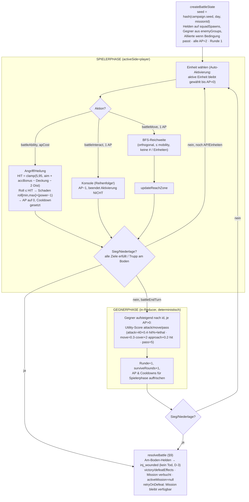

# Worldgate — System- und Loop-Inventur (Engine-Übergang)

> **Zweck.** Bestandsaufnahme des Prototyps als Grundlage für die Entscheidung
> „welche Engine als Nächstes". Read-only erstellt; **der Code ist die Wahrheit,
> die Specs sind die Behauptung** — jede Abweichung ist als _Befund_ markiert.
> Stand: `main` + Branch `claude/system-loop-inventur-miorkt`, Kampagnenstand
> nach dem Veyra-Bogen (6.3 Balance/Content abgeschlossen, 305 Tests grün).
> Bindend gelesen: `ARCHITECTURE.md`, alle `docs/specs/*.md`, der gesamte
> `src/`-Baum, alle `src/data/content/*.json`.

---

## 0. Kurzurteil vorweg

Der Prototyp ist **mechanisch weitgehend fertig und determiniert**, aber
**inhaltlich dünn und narrativ auf genau einen linearen Bogen zugeschnitten**.
Die Sim-Schicht (`src/core`) ist sauber gekapselt, rein, seed-determiniert und
gut getestet — das ist der wertvolle, portierbare Kern. Das Fun-Risiko liegt
nicht im Code, sondern im **Mengengerüst**: 4 Techs (2 davon nur Logzeilen),
4 Gebäude mit schmalem Wirkungsfenster, 3 Taktikkarten, 1 rekrutierbarer Held,
und ein Held-Stat-System, dessen halbe Fläche (Archetypen, `engineering`) im
Content **nie abgefragt** wird.

---

## 1. Der Loop als Grafik

### 1a. Kompletter Spielablauf (Kampagne → Basis → Weltentor → Missionskette → zurück)

```mermaid
flowchart TD
    MENU["Hauptmenü\n(Neue Kampagne / Fortsetzen / Import)"] -->|newCampaign seed, content| INTRO

    INTRO["ev_intro (Narrativ, Auto-Start)\nout_in_go → unlockMission m_vy_arrival"] --> BASE

    subgraph BASISSCHLEIFE["BASIS — BaseScreen (Tag-für-Tag)"]
        BASE["Basis-Hub"]
        BASE --> PERS["Personal zuweisen\nlogistics / research / infirmary\n(assignPersonnel)"]
        BASE --> FORS["Forschung\n(startResearch, TechScreen)"]
        BASE --> BAU["Bau\n(build, FacilitiesPanel)"]
        BASE --> ROST["Team ansehen\n(RosterScreen, read-only)"]
        PERS --> ENDDAY
        FORS --> ENDDAY
        BAU --> ENDDAY
        ENDDAY["Tag beenden (endDay)\n1 Einkommen · 2 Unterhalt · 3 Forschung ·\n3b Bau · 4 Erholung · 5 Tag+1 · 6 Vorfall feuern"]
        ENDDAY -->|Tag+1| BASE
    end

    BASE -->|Weltentor öffnen| WG
    ENDDAY -->|fällige Queue-Events\nfireDueIncident| INTRO2["Queue-Vorfall\n(Narrativ, erzwungen)"]
    INTRO2 --> RESOLVE

    WG["Weltentor — WorldgateScreen\nMission wählen + Trupp entsenden\n(launchMission)"] -->|Operation vy: Trupp wird gesperrt| DEPLOY

    subgraph OPERATION["OPERATION vy (Deployment) — Trupp gesperrt, keine Erholung"]
        DEPLOY{Payload?}
        DEPLOY -->|narrative| NARR["Erzähl-Mission\nEventScreen (chooseEventOption)\nKnotengraph → Outcome"]
        DEPLOY -->|tactical| TAC["Taktik-Mission\nBattleScreen (battle*)\nsiehe Diagramm 1b"]
        NARR --> RESOLVE
        TAC --> RESOLVE
        RESOLVE["Ergebnisse / Summary\nXP · Fatigue · Verletzung · Ressourcen ·\nFlags · Freischaltungen · Debrief-Zeile"]
        RESOLVE -->|deploymentNextMission == genau 1\nSummaryActions: Weiter| DIRECT["DIREKTÜBERGANG\nlaunchMission mit gesperrtem Trupp\n(kein Umweg über Basis)"]
        DIRECT --> DEPLOY
    end

    RESOLVE -->|Zurück zur Basis| BASE
    RESOLVE -->|Outcome-Effekt endDeployment\n(ev_vy_homecoming)| OPEND["Operation beendet\nTrupp ruht wieder"]
    OPEND --> BASE

    %% Konkreter Bogen (Act 1)
    classDef t fill:#3a2,stroke:#161,color:#fff
    classDef n fill:#248,stroke:#036,color:#fff
    SPINE["Konkrete Kette:\nm_vy_arrival(N) → m_vy_ledger(N) → m_vy_intercept(T) →\nm_vy_1(N) → m_vy_2(N) → m_vy_3(N) → m_vy_breakout(T) → m_vy_home(N)\nSeitenmission: m_relay(T), freigeschaltet durch Forschung t_gate_stabilizer"]
```

**Lesehilfe zum Loop:**

- Der **Direktübergang** (`SummaryActions` → „Weiter: …") überspringt Basis und
  Truppauswahl, solange die Operation läuft und genau **eine** Folgemission der
  Operation freigeschaltet wurde (`deploymentNextMission`). Dadurch fühlt sich
  der Bogen wie eine durchlaufende Kette an — **es vergeht dabei kein Tag**
  (`endDay` läuft nur an der Basis). Einkommen, Forschung, Bau und Erholung
  ruhen also während einer durchgezogenen Operation.
- Während eines Deployments kann der Spieler dennoch zur Basis zurück und dort
  `endDay` drücken (Bauen/Forschen/Einkommen laufen), **aber der gesperrte Trupp
  erholt sich nicht** (Recovery überspringt `deployment.squad`) — Fatigue steigt
  monoton, was zum Durchziehen drängt.
- **Queue-Vorfälle** (`queueEvent` → `fireDueIncident` in `endDay`, Schritt 6)
  sind der einzige Weg, wie außerhalb der Missionswahl eine Erzählmission
  erzwungen wird (Squad = alle nicht-erschöpften Helden). Aktuell im Content:
  `ev_vy_dessik_word` (+5 T), `ev_vy_gratitude` (+3 T), `ev_vy_seryn_oath` (+2 T).

### 1b. Taktik-Rundenablauf (eine Schlacht)



> Determinismus-Kern (§4/§7): Die Schlacht zieht aus **einem** Strom
> `mulberry32(seed)`. `BattleState` speichert **keinen Cursor** — die
> Stromposition wird bei jedem Reducer-Aufruf durch **Zählen der geloggten
> „roll: "-Zeilen** rekonstruiert. Genau das hält die Golden-Battle-Tests über
> die vielen Reducer-Aufrufe einer Schlacht stabil.

---

## 2. Systemkatalog

Jeder Block: **Zweck · Ist-Verhalten · Datenquellen · Urteil**. Das Urteil ist
genau eine der drei Klassen — **F&E** = _funktional & im Spiel erklärt_,
**F/U** = _funktional, aber unerklärt_, **WL** = _im aktuellen Content
wirkungslos_. Carve-outs sind explizit benannt; nichts beschönigt.

### 2.1 Ressourcen & Einkommen — **F&E** (mit WL-Carve-outs)

- **Zweck:** Vier Ressourcen als Wirtschaftsbasis: `funds`, `materials`,
  `intel`, `exotics`.
- **Ist:** `funds` = Einkommen − Unterhalt (Tagestick). Einkommen
  `floor(logistics·3·supportMult·incomeMult)`; Unterhalt
  `personnel.total·1 + heldenzahl·2` (Start = 28). `materials` fließen nur aus
  `fac_workshop` (+2/Tag) und Event-/Missionseffekten; **kein bedingungsloses
  Material-Einkommen** (daher `launchCost:0` auf Pflicht-Taktikschlachten, sonst
  Softlock). Kosten: Forschung (nicht Ressource, sondern FP), Bau
  (funds+materials), Taktik-Launch (materials).
- **Datenquellen:** `economy.ts` (Formeln), `schemas.ts ResourceAmounts`,
  `campaign.ts` (Start 100/40/0/0), `ResourceBar.tsx`.
- **Urteil:** `funds`/`materials` **F&E** (ResourceBar zeigt Werte, endDay
  spürbar). **Befund (WL):** `intel` wird verdient (Intro +4, `m_relay`-Sieg +5),
  hat aber **keinen Sink** — nichts liest oder verbraucht es je. `exotics` wird
  im gesamten Content **nie berührt** (weder erhalten noch ausgegeben) → totes
  Ressourcenfeld.

### 2.2 Personal & Zuweisungen — **F&E**

- **Zweck:** `personnel.total` auf drei Tracks verteilen, die je einen
  Wirtschaftshebel treiben.
- **Ist:** `logistics` → Einkommen (×3/Kopf), `research` → FP/Tag (×1/Kopf),
  `infirmary` → Erholung (`5 + 2·infirmary + 5·healRate`). Zuweisung validiert
  (Summe ≤ total). Start 20 (12/6/2). `fac_quarters` hebt total um 5.
- **Datenquellen:** `economy.ts`, `schemas.ts personnel`, `PersonnelPanel.tsx`
  (nennt für jeden Track „Was er treibt").
- **Urteil:** **F&E** — Panel erklärt jeden Track wörtlich; Effekte über endDay
  spürbar.

### 2.3 Forschung — **F&E** als Mechanik, aber inhaltlich halb WL

- **Zweck:** FP/Tag in Techs umsetzen, die einmalig Effekte anwenden.
- **Ist:** `research.current` akkumuliert `research·1 + researchBonus`; bei
  `≥ cost` fertig, Effekte via `applyEffects`. Sichtbarkeit über `visibleIf`
  (leerer Squad-Kontext); `canStartResearch` verlangt Sichtbarkeit + Prereqs.
- **Datenquellen:** `economy.ts`, `techs.json`, `TechScreen.tsx`.
- **Urteil / Befund:** Von **4 Techs** haben nur **2 einen mechanischen Effekt**:
  `t_gate_stabilizer` (`unlockMission m_relay` — die einzige Tech mit _sichtbarer
  Spielfolge_) und `t_field_medicine` (`healRate +1`, unsichtbare Zahl).
  `t_radiance_cell` und `t_projection_theory` haben **nur `log`-Effekte** (reine
  Kodex-Flavourzeilen) und stecken hinter Arc-Flags — mechanisch **WL**.
  Zusatzbefund: Weil der Bogen als durchlaufende Operation gespielt wird
  (Direktübergänge, kein `endDay`), hat der Spieler real wenig Gelegenheit,
  überhaupt zu forschen. Gesamturteil der _Mechanik_: **F&E**; die _Content-Menge_
  ist der Schwachpunkt.

### 2.4 Gebäude (Facilities) — **F&E** (schwaches Bogen-Fenster)

- **Zweck:** Basis-Ausbau über die universelle Effect-Sprache; ein Bau
  gleichzeitig, kein Upkeep (v1).
- **Ist:** `build` zahlt Kosten sofort, `advanceConstruction` zählt `buildDays`
  herunter (endDay-Schritt zwischen Forschung und Erholung), wendet Effekte an.
  Alle **4 Gebäude** wirken mechanisch: `fac_quarters` (+5 Personal),
  `fac_medbay` (+1 healRate), `fac_workshop` (+2 materials/Tag), `fac_gate_lab`
  (+2 researchBonus, Prereq `t_gate_stabilizer`).
- **Datenquellen:** `construction.ts`, `facilities.json`, `FacilitiesPanel.tsx`.
- **Urteil:** **F&E** — Panel zeigt Kosten, Bauzeit, Effektbeschreibung, Sperre.
  **Befund:** Wirkung real, aber Payoff-Fenster im aktuellen (kurzen, gesperrten)
  Bogen dünn; Starteinkommen an `materials` (40) deckt nicht alle Bauten — die
  Reihenfolge ist die einzige echte Entscheidung.

### 2.5 Helden — **F&E** (mit harten WL-Carve-outs)

- **Zweck:** Persistente Einsatzkräfte mit Stats, XP/Level, Fatigue,
  Verletzungen.
- **Ist:**
  - **Stats:** 5 Fertigkeiten (`combat, science, engineering, diplomacy,
resolve`). _Effektiv_ = Basis + `skillBonuses` + Verletzungs-Malus + Fatigue
    (`−1` ab „müde"), als Selektor berechnet, nie gespeichert.
  - **XP/Level:** Cap 5, Schwellen `[0,25,75,150,250]`. Level-up gibt `+1` auf
    die **höchste Basis-Fertigkeit** (Tie: Enum-Reihenfolge). XP nur aus
    Taktiksiegen (`m_vy_intercept +15`, `m_relay +15`, `m_vy_breakout +20`) und
    5 Event-`xp`-Effekten.
  - **Fatigue:** 0–100; ≥50 müde (`−1` alle), ≥80 erschöpft (nicht einsetzbar).
    Erholung `5 + 2·infirmary + 5·healRate`, im Deployment ausgesetzt.
  - **Verletzungen:** `inj_wounded` (combat `−2`, 5 T, aus Am-Boden im Kampf),
    `inj_shaken` (resolve `−2`, 3 T, aus `m_vy_breakout`-Niederlage).
- **Datenquellen:** `roster.ts`, `effects.ts` (xp/injury/fatigue),
  `heroes.json`, `injuries.json`, `RosterScreen.tsx` (zeigt Level, XP-Fortschritt,
  Fatigue+Schwellen, effektive Skills mit Malus-Delta, Verletzungs-Chips).
- **Urteil:** **F&E** — RosterScreen legt alles offen. **Befunde (schwerwiegend):**
  1. In der **Taktik wird nur `combat`** gelesen (`aim = 60 + 5·effCombat`).
  2. In der **Narrative** werden abgefragt: `diplomacy` (12×), `science` (9×),
     `combat` (6×), `resolve` (1×) — **`engineering` NIE**, in keinem System.
  3. Damit sind **Level-ups für 3 von 5 Helden mechanisch mager oder tot:**
     Brandt (Basis eng 7) speist Level-ups in `engineering` → **komplett
     wirkungslos**; Okafor (science) und Okonkwo (resolve) speisen selten
     abgefragte Skills; nur Mercer/Seryn (combat) spüren ihr Level taktisch.
  4. **Archetypen** (`squadHasArchetype`) werden **nirgends** abgefragt (0 Content).

### 2.6 Missionen & Freischaltketten — **F&E**

- **Zweck:** Fortschritt als Kette freischaltbarer Missionen.
- **Ist:** `missions.available` wächst über `unlockMission` (Tech-, Missions-
  Sieg-, Event-Outcome-Effekte). Verfügbarkeit zusätzlich über `availability`.
  `newlyUnlockedMissions`/`deploymentNextMission` speisen Summary/Direktübergang.
- **Datenquellen:** `missions.ts`, `narrative.ts`, `missions.json`,
  `NextMissions.tsx`, `WorldgateScreen.tsx`.
- **Urteil:** **F&E**. **Befunde (toter Content):** `m_vy_4`/`m_vy_5` sind per
  **D-16** für Akt 2 zurückgestellt — im Content vorhanden, aber von nichts (mehr)
  freigeschaltet → in Akt 1 **unerreichbar**. `ev_vy_regroup` ist **verwaist**:
  nichts feuert es (kein `queueEvent`-Ziel, keine Mission-Payload), seit
  `m_vy_intercept` per `retryOnDefeat` statt Regroup-Queue arbeitet.

### 2.7 Deployment & Operation — **F&E**

- **Zweck:** Eine mehrteilige Operation mit gesperrtem Trupp „ohne Rückkehr".
- **Ist:** Erste Mission mit `operation` öffnet `deployment` und sperrt den Squad;
  Folgemissionen derselben Operation nutzen ihn wieder (keine Neuauswahl,
  Erschöpfungssperre ausgesetzt). Erholung überspringt den Squad. `retryOnDefeat`
  hält verlorene Taktikmissionen verfügbar. `endDeployment` (Homecoming-Outcome)
  beendet die Operation.
- **Datenquellen:** `missions.ts`, `effects.ts (endDeployment)`, `economy.ts`
  (Recovery-Skip), `schemas.ts deployment`, `WorldgateScreen.tsx` (🚩-Banner,
  „Operation ohne Rückkehr"-Warnung).
- **Urteil:** **F&E** — Banner + Warnung + Direktübergang erklären den Zustand.

### 2.8 Narrativ-Engine — **F&E** (mit WL-Carve-outs)

- **Zweck:** Deterministischer Knotengraph mit Bedingungen/Effekten (kein RNG,
  D-5), Branch-and-Bottleneck (D-6).
- **Ist:** `evalCondition` (ein Evaluator für alles) deckt flag/variable/resource/
  techResearched/squadHasArchetype/squadSkillAtLeast/all/any/not ab; Squad-
  Bedingungen lesen **effektive** Skills (Fatigue/Verletzung zählen). Optionen:
  `eligibleOptions` liefert `eligible` + `gatedBySquad`. `chooseEventOption`
  armiert `gatedSeen`, wendet Options- dann Outcome-Effekte an, verzweigt Knoten
  oder endet. `lockedReason` + `showLockedOptions` (Default `true`, D-15) steuern
  gesperrte Optionen. Textanimation (D-13): `parseNarration` (rein) zerlegt Text
  in Worte, `" & "`/`" && "` als kurze/lange Pausenmarke; `useNarration`
  (setTimeout) blendet Wort für Wort ein; Setting `on/fast/off`.
- **Datenquellen:** `narrative.ts`, `effects.ts`, `events.json`,
  `EventScreen.tsx`, `parseNarration.ts`, `useNarration.ts`, `contentMarks.test.ts`.
- **Urteil:** **F&E** (Engine reich, UI erklärt Sperren/Deltas/Tempo).
  **Befunde (Content nutzt Engine nur teilweise):** `squadHasArchetype` (0 Uses),
  `engineering`-Gate (0 Uses), `personnel`- und `modifier`-Effekt in Events
  (0 Uses); **8 Flags gesetzt, aber nie gelesen** (`f_vy_anchor_destroyed`,
  `f_vy_expedition_freed`, `f_vy_fought_god`, `f_vy_godtech`, `f_vy_ilo_freed`,
  `f_vy_sacrament_dose`, `f_vy_watched_god`, `intro_cautious`); nur **1** Option
  trägt einen authored `lockedReason`.

### 2.9 Taktik — **F&E**

- **Zweck:** XCOM-artige, seitenbasierte Rundenschlacht auf Quadratgitter.
- **Ist (alles implementiert & getestet):** 2 AP/Einheit; Bewegung (BFS,
  orthogonal, `mobility 4`); LOS (Bresenham, nur `#`/`+` blocken durch, Endpunkte
  nie); Deckung (`-` 20, `+` 40); Trefferformel `clamp(5,95, aim + accuracyBonus
− Deckung − 2·Dist)` — **Preview === Resolver** (`hitChance`); Fähigkeiten
  beenden die Aktivierung, Cooldowns; Interact (Reihenfolge erzwungen, beendet
  Aktivierung nicht); Ziele (`eliminateAll`, `interactSequence`, `surviveRounds`,
  `reachZone`); deterministische Utility-KI; Overlays für Reichweite,
  Fähigkeits-Range und **Bedrohungszone** (`abilityRangeTiles`/`threatenedTiles`,
  identisch mit den Guards). `accuracyBonus` (Tuning v3) fließt vor dem Clamp ein.
- **Datenquellen:** `tactics.ts`, `tacticsConstants.ts`, `abilities.json`,
  `unit-types.json`, `maps.json`, `BattleCanvas.ts`, `battleModel.ts`, `replay.ts`.
- **Urteil:** **F&E** — der reifste Teil des Prototyps; die UI zeigt Hit-%,
  AP-Badges und alle drei Overlays. **Befunde (Content-Lücken):** nur **3 Karten**;
  von 4 Zielarten nutzt der Content nur **2** (`interactSequence`, `reachZone`) —
  `eliminateAll`/`surviveRounds` sind **definiert, aber von keiner Karte genutzt**;
  Gegnertyp `ut_tender` („Drohne") ist **definiert, aber in keiner Karte
  referenziert** (tot).

### 2.10 Support-Variable — **F/U**

- **Zweck:** Einkommens-Multiplikator und Platzhalter für ein späteres
  Politiksystem (D-6: Support ist Daten, kein Sondersystem — `variables.support`).
- **Ist:** `supportMult = clamp(0.5, 1.5, 0.75 + 0.05·support)`. Start 5 (→ ×1.0).
  Bewegt sich durch: verpassten Zahltag (`−1`), `m_relay`-Niederlage (`−1`), **ein**
  Event-Effekt (`+2`). Gelesen **nur** von der Einkommensformel.
- **Datenquellen:** `economy.ts`, `campaign.ts`, `ResourceBar.tsx` (zeigt die Zahl
  als „Unterstützung").
- **Urteil:** **F/U** — die Zahl ist sichtbar, ihr **Multiplikator-Effekt aber
  nirgends erklärt**, und im aktuellen Content bewegt sie sich kaum. In Events
  wird `support` zwar `+2` geschrieben, aber **nie als Bedingung gelesen**.

### 2.11 Journal — **F&E**

- **Zweck:** Kampagnen-Logbuch.
- **Ist:** Append-only `journal[{day,text}]`; Core schreibt deutsche Literale
  (Forschung fertig, Zahltag verpasst, Verletzung/Erholung, Missions-/Bau-Zeilen,
  `log`-Effekte). `Journal.tsx` zeigt neueste zuerst.
- **Urteil:** **F&E**.

### 2.12 Save/Load — **F&E** (Autosave still)

- **Zweck:** Persistenz + Export/Import.
- **Ist:** `serialize` = `JSON.stringify(GameState.parse(...))`, `deserialize`
  validiert per Zod → ungültiger/veralteter Stand wird **laut** abgelehnt
  (`version: 2` literal; Politik „Bump = neue Kampagne"). Autosave nach **jeder**
  Aktion in `localStorage["worldgate/save/v1"]`; Export/Import als String im Menü.
- **Datenquellen:** `serialize.ts`, `persistence.ts`, `MainMenu.tsx`.
- **Urteil:** **F&E** (Export/Import erklärt; Autosave selbst still, aber unkritisch).

### 2.13 Missions-Summary & Direktübergang — **F&E**

- **Zweck:** Nachbesprechung + nahtlose Fortsetzung der Operation.
- **Ist:** Kein eigener Screen — Event- und BattleScreen rendern lokal eine
  Summary (vor `activeMission=null` erfasst): sichtbare Deltas, `debrief`-Zeile
  (Taktik nur bei Sieg / Narrativ pro Outcome), `NextMissions` (auto-abgeleitet),
  `SummaryActions` → „Weiter: …" (Direktstart mit gesperrtem Squad) oder „Zurück
  zur Basis".
- **Datenquellen:** `missions.ts`-Selektoren, `SummaryActions.tsx`,
  `NextMissions.tsx`, `EventScreen.tsx`, `BattleScreen.tsx`.
- **Urteil:** **F&E**.

### 2.14 UI-Screens (Überblick) — **F&E**

Top-Level-Router `App.tsx` mit `Screen = menu | base | tech | roster | worldgate |
event | battle` (kein eigener Summary-State — Summary lebt in event/battle).
Aktive Mission erzwingt den Screen (`narrative→event`, `tactical→battle`).

| Screen          | Zweck                                                            | liest                                                    | dispatcht                             |
| --------------- | ---------------------------------------------------------------- | -------------------------------------------------------- | ------------------------------------- |
| MainMenu        | Neu/Fortsetzen/Export-Import                                     | —                                                        | (Callbacks)                           |
| BaseScreen      | Hub: ResourceBar, End-Day, Nav, Personal/Facilities/Journal      | `activeMission`, `resources`, u. a.                      | `endDay`                              |
| TechScreen      | Forschungsbaum                                                   | `research`, `techs` (`techVisible`)                      | `startResearch`                       |
| RosterScreen    | Helden read-only (Level, XP, Fatigue, eff. Skills, Verletzungen) | `heroes`, Selektoren                                     | —                                     |
| WorldgateScreen | Missionswahl + Truppentsendung, Deployment-Banner/Warnung        | `missions.available`, `deployment`, `heroes`             | `launchMission`                       |
| EventScreen     | Erzähl-Pane, animierter Text, Optionen, Summary                  | `activeMission`, `events`, `eligibleOptions`, `settings` | `chooseEventOption`, `updateSettings` |
| BattleScreen    | Pixi-Board, Aktionsleiste, Replay, Summary                       | `activeMission`, `heroes`, `buildBattleView`             | `battle*`, `launchMission`            |

Urteil: **F&E** — touch-first (≥44 px), Portrait strategisch, Landscape taktisch;
`ErrorBoundary` + `RuleError`-Banner.

---

## 3. Zahlen-Anhang

### 3.1 Ökonomie & Roster (`economy.ts`, `roster.ts`, `campaign.ts`)

| Größe                    | Formel / Wert                                                    |
| ------------------------ | ---------------------------------------------------------------- |
| Startressourcen          | funds 100 · materials 40 · intel 0 · exotics 0                   |
| Startvariablen           | support 5 · trust_andara 0                                       |
| Startpersonal            | total 20 (logistics 12 / research 6 / infirmary 2)               |
| Startkader               | h_mercer, h_okafor, h_brandt, h_okonkwo (4)                      |
| Einkommen/Tag            | `floor(logistics · 3 · supportMult · incomeMult)`                |
| supportMult              | `clamp(0.5, 1.5, 0.75 + 0.05 · support)`                         |
| Unterhalt/Tag            | `personnel.total · 1 + heldenzahl · 2` (Start = 28)              |
| Zahltag verpasst         | funds→0, `support −1`, Journalzeile                              |
| Forschung/Tag            | `research · 1 + researchBonus`                                   |
| Material/Tag             | `floor(materialsPerDay)` (nur via fac_workshop)                  |
| Erholung/Tag             | `fatigue −= (5 + 2 · infirmary + 5 · healRate)` (floor 0)        |
| Fatigue-Schwellen        | müde ≥ 50 (`−1` alle Skills) · erschöpft ≥ 80 (nicht einsetzbar) |
| XP-Schwellen (kumuliert) | L2 25 · L3 75 · L4 150 · L5 250 · Cap 5                          |
| Level-up                 | `+1` auf höchste **Basis**-Fertigkeit (Tie: Enum-Reihenfolge)    |
| Taktik-Launch-Kosten     | `TACTICAL_LAUNCH_COST = 5` materials (Override `launchCost`)     |

**Modifier-Defaults** (`modifiers.ts`): `incomeMult 1`, `researchBonus 0`,
`healRate 0`, `materialsPerDay 0`. Unbekannte Keys werden gespeichert, aber inert.

### 3.2 Taktik-Konstanten (alle **(T)**, `tacticsConstants.ts`)

| Konstante                                    | Wert          | Bedeutung                                   |
| -------------------------------------------- | ------------- | ------------------------------------------- |
| HERO_MAX_HP                                  | 5             | flach für jeden Helden                      |
| HERO_AIM_BASE / _PER_COMBAT                  | 60 / 5        | `aim = 60 + 5·effCombat` (Rebase v3: 55→60) |
| HERO_MOBILITY                                | 4             | Felder/Bewegung                             |
| HERO_DMG_MIN / _MAX                          | 1 / 2         | Waffenschaden                               |
| AP_PER_TURN                                  | 2             | AP/Phase                                    |
| MOVE_AP_COST / INTERACT_AP_COST              | 1 / 1         |                                             |
| ABILITY_ENDS_AP                              | 0             | Fähigkeit beendet Aktivierung               |
| HIT_MIN / HIT_MAX                            | 5 / 95        | Clamp der Trefferchance                     |
| RANGE_PENALTY_PER_TILE                       | 2             | pro Feld Distanz                            |
| COVER_BONUS_LOW / HIGH / NONE                | 20 / 40 / 0   | `-` / `+` / sonst                           |
| AI_ATTACK_BASE / _HIT_WEIGHT / _LETHAL_BONUS | 40 / 0.4 / 25 | Angriffs-Score                              |
| AI_MOVE_COVER / _APPROACH / _HIT_WEIGHT      | 0.3 / 2 / 0.2 | Bewegungs-Score                             |
| AI_PASS_SCORE                                | 5             | Untergrenze für echte Aktion                |

**Trefferformel:** `clamp(5, 95, aim + accuracyBonus − Deckung − 2·manhattanDist)`.
**Schaden:** `roll[dmgMin, dmgMax] + (power − 1)`, nur bei Treffer.
**Ziehreihenfolge (streng):** 1) Trefferwurf `int(1,100)`, Treffer bei `≤ hit%`; 2) nur bei Treffer Schadenswurf. Jeder Wurf als `roll: `-Zeile geloggt.

### 3.3 Fähigkeiten & Einheiten

| Ability           | apCost | range | targeting | power | accBonus | cooldown | Träger                            |
| ----------------- | ------ | ----- | --------- | ----- | -------- | -------- | --------------------------------- |
| ab_shot           | 1      | 8     | enemy     | 1     | 0        | 0        | alle Helden + ut_raider/ut_tender |
| ab_patch          | 1      | 1     | ally      | 2     | 0        | 2        | h_okafor                          |
| ab_precision_shot | 2      | 8     | enemy     | 2     | 20       | 3        | h_mercer                          |
| ab_stab           | 1      | 1     | enemy     | 2     | 0        | 0        | ut_tender_guard                   |
| ab_blade          | 1      | 1     | enemy     | 3     | 0        | 0        | ut_seryn_blessed                  |

| UnitType         | maxHp | aim | mob | dmg | abilities | genutzt?                |
| ---------------- | ----- | --- | --- | --- | --------- | ----------------------- |
| ut_raider        | 4     | 65  | 4   | 1–2 | ab_shot   | ✅ map_relay            |
| ut_tender        | 5     | 60  | 3   | 1–2 | ab_shot   | ❌ **von keiner Karte** |
| ut_tender_guard  | 4     | 60  | 5   | 1–2 | ab_stab   | ✅ intercept, breakout  |
| ut_seryn_blessed | 7     | 75  | 5   | 1–2 | ab_blade  | ✅ breakout (Ally)      |

### 3.4 Content-Mengengerüst

| Kategorie               | Anzahl                      | Anmerkung                                                                 |
| ----------------------- | --------------------------- | ------------------------------------------------------------------------- |
| Helden                  | **5**                       | 4 Start + h_seryn (rekrutierbar via ev_vy_first_blade / ev_vy_seryn_oath) |
| Techs                   | **4**                       | 2 mechanisch, 2 nur `log`; nur 1 mit sichtbarer Spielfolge                |
| Gebäude                 | **4**                       | alle mechanisch                                                           |
| Fähigkeiten             | **5**                       | 3 Helden-, 2 Gegner-seitig; alle referenziert                             |
| Unit-Typen              | **4**                       | 1 (`ut_tender`) ungenutzt                                                 |
| Verletzungen            | **2**                       | inj_wounded (combat−2), inj_shaken (resolve−2)                            |
| Taktikkarten            | **3**                       | map_relay, map_vy_intercept, map_vy_breakout                              |
| Zielarten (Schema)      | **4**                       | genutzt: 2 (interactSequence, reachZone)                                  |
| Missionen               | **11**                      | 3 taktisch, 8 narrativ; 2 (m_vy_4/5) in Akt 1 unerreichbar                |
| Event-Skripte           | **13**                      | 1 (`ev_vy_regroup`) verwaist                                              |
| Event-Knoten            | **75**                      |                                                                           |
| Event-Outcomes          | **26**                      |                                                                           |
| Event-Optionen          | **145**                     | 1 mit `lockedReason`                                                      |
| Flags                   | **28 gesetzt / 20 gelesen** | 8 gesetzt-aber-nie-gelesen                                                |
| Variablen               | **3**                       | trust_andara (3-Wege-Gate), doubt (Binär-Gate), support (nur Einkommen)   |
| squadSkillAtLeast-Gates | 28                          | diplomacy 12 · science 9 · combat 6 · resolve 1 · **engineering 0**       |
| squadHasArchetype-Gates | **0**                       | Archetypen nie abgefragt                                                  |
| queueEvent-Vorfälle     | 3                           | dessik_word +5T · gratitude +3T · seryn_oath +2T                          |

---

## 4. Portierungs-Matrix

Zwei Spalten: **engine-agnostisch** (bleibt bei einem Engine-Wechsel als
Spezifikation/Daten erhalten) vs. **engine-gebunden** (an React/Pixi/Web
gekoppelt, Neubau bei Wechsel). Aufwandsklasse je Block: **trivial / moderat /
Neubau**.

### 4a. Engine-agnostisch (Wert, der bleibt)

| Block                                                                                                                     | Aufwandsklasse | Ein-Satz-Begründung                                                                                                                                                    |
| ------------------------------------------------------------------------------------------------------------------------- | -------------- | ---------------------------------------------------------------------------------------------------------------------------------------------------------------------- |
| Sim-Regeln als Spezifikation (`src/core`: economy, roster, narrative, tactics, effects, construction, missions, RNG/hash) | **moderat**    | Reine, deterministische Logik ohne DOM/Pixi/React — 1:1 als Regelwerk beschrieben, in der Zielsprache/-engine nachzubauen, aber vollständig durch Specs+Tests fixiert. |
| Content-JSON (9 Dateien)                                                                                                  | **trivial**    | Reine Daten, IDs/Flags/Variablen engine-neutral — direkt übernehmbar.                                                                                                  |
| Zod-Schemas (`schemas.ts`)                                                                                                | **moderat**    | Formen (Def vs State, Effect/Condition-Vokabular) sind portabel; die Validierung ist in der Ziel-Toolchain neu auszudrücken.                                           |
| Spec-Dokumente (`docs/specs/*`, `ARCHITECTURE.md`)                                                                        | **trivial**    | Bereits engine-neutrale Prosa; direkt weiterverwendbar.                                                                                                                |
| Test-**Semantik** (Golden Battles, Property-Roundtrip, Greedy-Sim, Content-Marks, Replay-Determinismus)                   | **moderat**    | Die _Bedeutung_ der Tests (exakte Endzustände, Determinismus, Referenz-Checks) ist engine-neutral; das Harness (Vitest) ist neu zu bauen.                              |
| Determinismus-Vertrag (mulberry32, `hash(seed,day,mission)`, cursorloser Log-Zählstrom)                                   | **moderat**    | Reiner Algorithmus — reproduzierbar in jeder Sprache, aber die exakte PRNG muss bit-genau nachgebildet werden, sonst brechen die Goldens.                              |

### 4b. Engine-gebunden (Neubau bei Wechsel)

| Block                                                                 | Aufwandsklasse | Ein-Satz-Begründung                                                                                                             |
| --------------------------------------------------------------------- | -------------- | ------------------------------------------------------------------------------------------------------------------------------- |
| React-Strategie-UI (7 Screens + Komponenten)                          | **Neubau**     | An React-Rendering/State gekoppelt; Layout/Interaktion in der Ziel-UI neu zu implementieren (Regeln sind aber schon in `core`). |
| PixiJS-Renderer (`BattleCanvas`, `viewport`, `replay`, `battleModel`) | **Neubau**     | WebGL-Zeichnen, Pinch/Zoom, Sprite-Handling — voll engine-spezifisch; nur die gelesenen Guards bleiben.                         |
| Textanimation (`useNarration`)                                        | **Neubau**     | setTimeout/React-getrieben; `parseNarration` (rein) hingegen **trivial** portierbar.                                            |
| localStorage-Persistenz (`persistence.ts`)                            | **moderat**    | Serialisierungsformat (JSON+Zod) portabel; das Storage-Backend (localStorage-Key, Autosave-Hook) ist zu ersetzen.               |
| Build/CI (Vite, `ci.yml`, GitHub Pages, Base `/Worldgate/`)           | **moderat**    | Pipeline-Verdrahtung und Deploy-Ziel sind an das Web-Toolchain gebunden; neu aufzusetzen.                                       |
| Deutsche Core-Literale (Journal/RuleError/Combat-Log)                 | **moderat**    | An Golden-Tests gepinnte Strings in `core` — beim Neubau als i18n-Kopplungspunkt zu behandeln.                                  |

---

## 5. Qualitätssicherungs-Inventar

Was der aktuelle Stack absichert — als **Anforderungsliste** formuliert:
_Der neue Stack muss Folgendes replizieren._

1. **Golden-Battle-Tests.** Fixed-Seed-Schlacht (`map_relay`, 10 Aktionen):
   exakte HP/Position/AP je Einheit, **Zeile-für-Zeile** das Treffer/Schaden-Log,
   Rundenzahl, Sieg-Resolution, plus Invariante „keine 0-HP-Einheit handelt je"
   und Voll-Determinismus (`JSON.stringify(a)===JSON.stringify(b)`).
   → _Neuer Stack muss reproduzierbare Schlachten mit exakt gepinntem Verlauf
   bieten._
2. **Property-Test Serialize-Roundtrip.** `deserialize(serialize(state))` deep-
   equal über **300** generierte Zustände (alle Union-Zweige), plus
   Malformed-JSON- und Falsch-Version-Ablehnung. → _Save-Format muss
   verlustfrei und schema-validiert round-trippen._
3. **Content-Validator mit Referenz-Checks** (`validate-content.ts`, CI-Gate):
   Zod-Shape des gesamten Bundles **plus** referenzielle Integrität —
   Effekt-Refs (`queueEvent.event`, `unlockMission.mission`, `injury.injury`,
   `addHero.hero`), Condition-Refs (`techResearched.tech`, rekursiv durch
   all/any/not), Tech-Prereqs, UnitType-Ability-Refs, Karten-Tilegitter
   (Länge=height, Zeilenbreite=width, nur `.#-+`), alle Positionen in Bounds,
   Objective-Refs, Event `entryNode`/`next.node`/`next.outcome`, Missions-Payload-
   Refs, **Squad-Spawn-Invariante** (`squadSpawns.length ≥ squad.max`). → _Neuer
   Stack braucht denselben Lade- **und** CI-seitigen Integritätscheck._
4. **Startbarkeits-Invariante** (`missions.test.ts`): jede Pflichtmission
   `squad.min ≤` einsetzbare Helden zum Zeitpunkt des Erreichens (motivierte den
   2→4-Startkader-Fix). → _Kampagne muss beweisbar durchspielbar bleiben (kein
   Softlock)._
5. **Marken-Schutz** (`contentMarks.test.ts`): pinnt 7 kanonische Pausenmarken-
   Passagen, prüft dass `parseNarration` alle `&` aus `fullText` entfernt, und
   eine Tripwire „Gesamtmarken ≥ 21". → _Text-Präsentation darf Content nicht
   still verändern._
6. **Greedy-/Deployment-Simulation** (`greedyBattle.ts`, `veyra-battles.test.ts`,
   `deployment.test.ts`): zielsuchender Planer spielt **echte** Reducer gegen die
   Live-KI (Intercept 2er/4er Sieg+Niederlage, Breakout mit/ohne Seryn, Retry-
   Pfad) und die ganze Kette Tal→…→Homecoming (monotone Fatigue, Recovery-Skip im
   Deployment, beide „Weiter"-Übergänge). → _Neuer Stack muss echte
   Durchspielbarkeit headless simulieren können._
7. **Replay-Determinismus** (`replay.test.ts`): Gegnerphase allein aus dem Log
   rekonstruierbar (ein Beat je Aktion), ohne Input-Mutation. → _Kampf-Log muss
   verlustfreie Wiedergabequelle sein._
8. **Design-Drift-Schutz durch (T)-Leitplanke:** Taktik-Tunables leben nur in
   `tacticsConstants.ts`, dürfen laut Spec-Kopf nur mit gleichzeitigem Spec-
   Update geändert werden; jede (T)-Änderung bricht die Golden-Battle _by design_
   und erzwingt Neuaufnahme. → _Neuer Stack braucht eine Ein-Ort-Tunable-Quelle
   mit Golden-Kopplung._ **Befund/Risiko:** aim-Werte liegen doppelt
   (`tacticsConstants.ts` **und** `unit-types.json`) und werden nur per Konvention
   synchron gehalten — **kein automatischer Cross-File-Check**.
9. **CI-Gates** (`ci.yml`, Node 22, Reihenfolge): `npm ci` → **format:check** →
   **typecheck** → **lint** (erzwingt §1-Import-/RNG-Grenzen) → **test** →
   **validate-content** → **build**; Deploy nach GitHub Pages nur auf `main`.
   → _Neuer Stack muss dieselbe Gate-Kette (inkl. Architektur-Lint und
   Content-Validierung) als Merge-Bedingung fahren._
10. **Architektur-Invarianten (ESLint `import/no-restricted-paths` + Ban der
    Globals):** `core` importiert nur aus `core`/`data`, nie `Math.random`,
    `Date.now`, `new Date()`, Timer. → _Die Rein-/Determinismus-Grenze muss
    maschinell erzwungen bleiben, nicht nur konventionell._

---

## 6. Keep / Fix / Cut

Abstimmungsvorlage für den Spieler. „**Fix**" nennt konkret, was fehlt — meist
**Content-Menge oder Spiel-Erklärung, nicht Code**.

| System                                                                 | Urteil                      | Ein-Satz-Begründung                                                                                                                                                    |
| ---------------------------------------------------------------------- | --------------------------- | ---------------------------------------------------------------------------------------------------------------------------------------------------------------------- |
| Taktik-Engine (AP, LOS, Deckung, Hit-Formel, KI, Overlays)             | **KEEP**                    | Reifster, best-getesteter Teil; Preview===Resolver und drei Overlays fühlen sich fertig an.                                                                            |
| Determinismus-Kern (RNG, Seed-Ableitung, cursorloser Log-Strom)        | **KEEP**                    | Ermöglicht Goldens, Headless-Balance und künftiges Replay — nicht anfassen.                                                                                            |
| Narrativ-Engine (Bedingungen/Effekte, Traversal, Locks, Textanimation) | **KEEP**                    | Mächtiges, deterministisches Vokabular; UI erklärt Sperren/Deltas/Tempo.                                                                                               |
| Ressourcen `funds`/`materials` + Personal/Zuweisungen                  | **KEEP**                    | Klare, erklärte Wirtschaftshebel mit spürbarem Tagestick.                                                                                                              |
| Deployment/Operation + Direktübergang + Summary                        | **KEEP**                    | Gibt dem Bogen Zug und Konsequenz; Warnung/Banner erklären den No-Return-Zustand.                                                                                      |
| Save/Load + Content-Validator + Test-Suite + CI-Gates                  | **KEEP**                    | Das Sicherheitsnetz, das den neuen Stack überhaupt vergleichbar macht (siehe §5).                                                                                      |
| Forschung                                                              | **FIX (Content)**           | Mechanik gut, aber nur 2/4 Techs wirken und nur 1 hat sichtbare Folge — **mehr Techs mit spürbaren Modifiern** und Forschungs-Downtime im Bogen nötig.                 |
| Gebäude                                                                | **FIX (Content/Erklärung)** | Alle 4 wirken, aber das Bogen-Fenster ist zu schmal — **Bau-Payoff sichtbar machen** (z. B. healRate/researchBonus als UI-Effektzeile) und Anlässe zum Bauen schaffen. |
| Helden-Level/XP                                                        | **FIX (Content)**           | Level-ups speisen für 3/5 Helden selten/nie gelesene Skills — **`engineering` irgendwo abfragen** oder Level-up-Skill-Wahl geben; sonst ist Aufstieg für Brandt tot.   |
| Support-Variable                                                       | **FIX (Erklärung)**         | Wirkt (Einkommens-×), aber unerklärt und im Content kaum bewegt — **Effekt sichtbar machen** und mehr Events, die Support lesen/schreiben.                             |
| Ressource `intel`                                                      | **FIX (Content)**           | Wird verdient, hat aber keinen Sink — **Verwendung geben** (Tech-/Missionskosten) oder aus dem HUD nehmen.                                                             |
| Zielarten `eliminateAll` / `surviveRounds`                             | **FIX (Content)**           | Vollständig implementiert, aber von keiner Karte genutzt — **je eine Karte** liefern, sonst ungenutzte Engine-Fläche.                                                  |
| Archetypen-Gates (`squadHasArchetype`)                                 | **FIX (Content)**           | Engine + Labels vorhanden, 0 Nutzung — **einige Event-Optionen** über Archetyp gaten, um Truppzusammenstellung spürbar zu machen.                                      |
| Ressource `exotics`                                                    | **CUT (vorerst)**           | Nie erhalten, nie gelesen — bis es einen Zweck gibt aus State/HUD nehmen (Schema-Feld belassen ist eine Fable-Tier-Entscheidung).                                      |
| `ut_tender` (Gegnertyp)                                                | **CUT/FIX**                 | Definiert, aber von keiner Karte referenziert — entweder einsetzen oder entfernen.                                                                                     |
| `ev_vy_regroup` (Event)                                                | **CUT**                     | Verwaist (nichts feuert es, seit `retryOnDefeat` greift) — toter Content, entfernen.                                                                                   |
| `m_vy_4` / `m_vy_5` (+ zugehörige Events)                              | **KEEP (geparkt)**          | Bewusst per D-16 für Akt 2 zurückgestellt; im Content lassen, aber als „unerreichbar in Akt 1" dokumentiert halten.                                                    |

---

### Methodik & Grenzen dieser Inventur

Gelesen wurde der vollständige `src/core`, alle `src/data`-Schemas und
Content-JSONs, die UI-/Renderer-Schicht, alle Specs, der Validator, die
CI-Konfiguration und `DEVELOPMENT_PLAN.md`. Zählungen (Optionen, Flags,
Skill-Gates) sind direkt aus den JSON-Dateien geparst. Wo Spec und Code
divergierten, gilt der Code: konkret dokumentiert sind der verwaiste
`ev_vy_regroup` (D-9 beschrieb noch eine Regroup-Queue, der Code nutzt
`retryOnDefeat`) und der in `maps.json` ungenutzte `ut_tender` (D-9 nannte ihn
als neuen Gegner der Intercept-Karte, die tatsächlich `ut_tender_guard` nutzt).
Keine Änderungen an Code, Content oder Specs — dies ist das einzige Deliverable.
