# Opening — reverse-engineered design (v1)

**Scope.** The entire current opening as it actually ships in
`src/data/content/` — intro → Andara valley → the Veyra arc, everything
merged. This document is _descriptive_: it reads back the content that exists
today, not the intended specs. Where the shipped content and the specs
(`docs/story/`, `docs/specs/`, `docs/story/arc-veyra.md`) disagree, this
document follows the **content**, and the disagreement is logged under
[§4 Inconsistencies found](#4-inconsistencies-found).

**Sources read:** `events.json`, `missions.json`, `techs.json`, `heroes.json`,
`src/core/campaign.ts` (initial state), `src/data/schemas.ts`,
`docs/specs/narrative-engine.md`, `docs/specs/economy-and-roster.md`.

**No content was changed to produce this document.**

---

## 0. The spine at a glance

```
ev_intro ──unlock──▶ m_vy_arrival ──▶ m_vy_ledger ──▶ m_vy_intercept ──▶ m_vy_1 ──▶ m_vy_2 ──▶ m_vy_3 ──▶ m_vy_4 ──▶ m_vy_5
(auto-launch,        (narrative,      (narrative,     (TACTICAL,         (narr.)   (narr.)   (narr.)   (narr.)   (narr.)
 Day 1)              Andara)          Andara/Karsu)   Andara/spires)     Veyra ────────────────────────────────────────▶
```

- `ev_intro` auto-launches at `newCampaign` (incident form, no MissionDef, squad
  = all starting heroes; `src/core/campaign.ts`). Its outcome unlocks
  `m_vy_arrival`.
- Each spine mission unlocks the next via `unlockMission` (in narrative
  outcomes, or `m_vy_intercept`'s tactical `victoryEffects`).
- **Andara (Address 04):** arrival, ledger, intercept. **Veyra (Address 09):**
  m_vy_1…5. The first crossing to Veyra is `m_vy_1`.
- **Off-spine:** `m_relay` (Address 07, tactical) unlocks from researching
  `t_gate_stabilizer`; it is not part of the opening spine and unlocks nothing.
- **Queued follow-ups (fire on later days):** `ev_vy_regroup` (+1d, on intercept
  defeat), `ev_vy_dessik_word` (+5d), `ev_vy_seryn_oath` (+2d), `ev_vy_gratitude`
  (+3d).

---

## 1. Full flowchart (missions · events · nodes · options)

Edge labels carry the option's gating (`req:`) and the key side effects
(`⇒`). Skill/variable gates are the engine's `squadSkillAtLeast` /
`variable` conditions. **Dashed red edges are mechanically unreachable** with
the shipped roster/flag logic — see §4.

```mermaid
flowchart TD
  classDef dead stroke:#c0392b,stroke-width:2px,stroke-dasharray:5 4,color:#c0392b;
  classDef orphan fill:#fff3cd,stroke:#b8860b;
  classDef tac fill:#dfe7fd,stroke:#3b5bdb;

  %% ============================ INTRO ============================
  subgraph INTRO["ev_intro — First Day (Day 1)"]
    in_sign["n_in_sign<br/>signed the posting; 'Since Cassy passed'"]
    in_ring["n_in_ring<br/>the ring; Okafor + Mercer wait"]
    in_ok["n_in_okafor ⇒ intel+4"]
    in_me["n_in_mercer ⇒ materials+4"]
    in_ok2["n_in_okafor_2"]
    in_me2["n_in_mercer_2"]
    in_dec["n_in_decide<br/>dial within the hour"]
    in_sign -->|o_in_down| in_ring
    in_ring -->|"o_in_science ⇒ intel+4"| in_ok
    in_ring -->|"o_in_threats ⇒ materials+4"| in_me
    in_ok -->|o_in_okafor_then| in_me2
    in_me -->|o_in_mercer_then| in_ok2
    in_me2 --> in_dec
    in_ok2 --> in_dec
    in_dec -->|o_in_commit| OUT_IN
    in_dec -->|"o_in_cautious ⇒ flag intro_cautious"| OUT_IN
  end
  OUT_IN(["out_in_go<br/>⇒ unlock m_vy_arrival · log 'Day 1'"])
  OUT_IN ==> M_ARR

  %% ============================ ARRIVAL ============================
  M_ARR{{"m_vy_arrival — The Silent Valley<br/>squad 2/2 · Mercer+Okafor"}}
  M_ARR --> va_gate
  subgraph ARR["ev_vy_arrival (Andara / Silent Valley)"]
    va_gate["n_va_gate<br/>green valley, two suns, snapped beacon"]
    va_vill["n_va_villagers<br/>silent villagers herd you off the road"]
    va_proc["n_va_procession<br/>porter Tenders pass to the gate"]
    va_esc["n_va_escape<br/>the boy falls; two flankers turn back"]
    va_hide["n_va_hide"]
    va_told["n_va_told<br/>elder draws the address; 'Veyra'"]
    va_run["n_va_run<br/>Mercer+Okafor kill two Tenders"]
    va_rungate["n_va_run_gate<br/>families dial out; Okafor reads it"]
    va_fight["n_va_fight<br/>brawl; a villager dies"]
    va_procf["n_va_procession_fight<br/>hide-cord address on the dead"]
    va_fexit["n_va_fight_exit<br/>silence is a verdict"]
    va_gate -->|o_va_road| va_vill
    va_vill -->|o_va_trust| va_proc
    va_vill -->|"o_va_refuse ⇒ flag vy_villager_killed · trust_andara−3 · fatigue+10"| va_fight
    va_proc -->|o_va_stay_down| va_esc
    va_esc -->|"o_va_hide ⇒ flag f_vy_boy_hidden · trust_andara+2"| va_hide
    va_esc -->|"o_va_run ⇒ flag f_vy_boy_run"| va_run
    va_hide --> va_told
    va_run -->|o_va_run_watch| va_rungate
    va_fight -->|o_va_freeze| va_procf
    va_procf --> va_fexit
    va_told -->|o_va_home| OUT_VA_HIDE
    va_rungate -->|o_va_run_home| OUT_VA_RUN
    va_fexit -->|o_va_home_cold| OUT_VA_FIGHT
  end
  OUT_VA_HIDE(["out_va_hide 'address freely given'<br/>⇒ unlock m_vy_ledger · xp+10"])
  OUT_VA_RUN(["out_va_run 'read off the dial'<br/>⇒ unlock m_vy_ledger · xp+10"])
  OUT_VA_FIGHT(["out_va_fight 'silence bought in blood'<br/>⇒ unlock m_vy_ledger · xp+5"])
  OUT_VA_HIDE ==> M_LED
  OUT_VA_RUN ==> M_LED
  OUT_VA_FIGHT ==> M_LED

  %% ============================ LEDGER ============================
  M_LED{{"m_vy_ledger — The Ledger of the Taken<br/>squad 2/2 · Karsu"}}
  M_LED --> vl_arrive
  subgraph LED["ev_vy_ledger (Andara / Karsu)"]
    vl_arrive["n_vl_arrive<br/>reception routes on trust_andara"]
    vl_welcome["n_vl_welcome (trust≥2)"]
    vl_story["n_vl_story<br/>the Luminous One, nine generations"]
    vl_ledger["n_vl_ledger<br/>four in fresh ink, pent below the Penitence"]
    vl_first["n_vl_first (Odel)<br/>Seryn Vael; the Portion at the road shrine"]
    vl_trans["n_vl_transport (Odel)<br/>grain-tithe, papers, pass spire"]
    vl_wary["n_vl_wary (0≤trust<2)"]
    vl_waryled["n_vl_wary_ledger (Odel)"]
    vl_barred["n_vl_barred (trust<0)"]
    vl_barledg["n_vl_barred_ledger (Odel)"]
    vl_arrive -->|"o_vl_warm req trust≥2"| vl_welcome
    vl_arrive -->|"o_vl_wary req 0≤trust<2"| vl_wary
    vl_arrive -->|"o_vl_closed req trust<0"| vl_barred
    vl_welcome --> vl_story --> vl_ledger --> vl_first --> vl_trans
    vl_trans -->|"o_vl_porters ⇒ materials−5 · flag f_vy_transport"| OUT_VL_T
    vl_trans -->|"o_vl_own_terms ⇒ fatigue+10"| OUT_VL_P
    vl_wary -->|o_vl_wary_ask| vl_waryled
    vl_waryled -->|"o_vl_wary_porters ⇒ materials−8 · flag f_vy_transport"| OUT_VL_T
    vl_waryled -->|"o_vl_wary_own ⇒ fatigue+10"| OUT_VL_P
    vl_barred -->|o_vl_listen| vl_barledg
    vl_barledg -->|"o_vl_high_country ⇒ fatigue+15 · materials−5"| OUT_VL_P
  end
  OUT_VL_T(["out_vl_transport 'porters' road'<br/>⇒ unlock m_vy_intercept · xp+10"])
  OUT_VL_P(["out_vl_pilgrims 'as pilgrims'<br/>⇒ unlock m_vy_intercept · xp+10"])
  OUT_VL_T ==> M_INT
  OUT_VL_P ==> M_INT

  %% ============================ INTERCEPT (tactical) ============================
  M_INT{{"m_vy_intercept — The Tribute Call<br/>TACTICAL · map_vy_intercept · squad 2/3 · launchCost 0"}}:::tac
  M_INT -->|"VICTORY ⇒ intel+5 · xp+15 · fatigue+20 · flag f_vy_call_intercepted · unlock m_vy_1"| M_1
  M_INT -->|"DEFEAT ⇒ support−1 · queue ev_vy_regroup +1d"| REGROUP
  subgraph RG["ev_vy_regroup (queued +1d)"]
    vr["n_vr_regroup"] -->|o_vr_again| OUT_VR(["out_vr_again ⇒ re-unlock m_vy_intercept"])
  end
  REGROUP -.-> RG
  OUT_VR -.re-run.-> M_INT

  %% ============================ PILGRIM ROADS (M1) ============================
  M_1{{"m_vy_1 — Pilgrim Roads<br/>squad 2/2 · FIRST crossing to Veyra"}}
  M_1 --> vy1_arrive
  subgraph P1["ev_vy_pilgrim_roads (Veyra terrace)"]
    vy1_arrive["n_vy1_arrive<br/>the Door opens one way in"]
    vy1_faces["n_vy1_faces<br/>faces on the terrace"]
    vy1_gather["n_vy1_gather (revisitable hub)"]
    vy1_pil["n_vy1_pilgrims_detail"]
    vy1_pat["n_vy1_patrols_detail"]
    vy1_rel["n_vy1_relay_detail (Okafor)<br/>'gods don't need encryption'"]
    vy1_plan["n_vy1_plan<br/>three ways in"]
    vy1_uni["n_vy1_uniform"]
    vy1_body["n_vy1_uniform_body"]
    vy1_des["n_vy1_dessik<br/>swear to free his son Ilo"]
    vy1_arrive -->|"o_..porters req f_vy_transport=T"| vy1_faces
    vy1_arrive -->|"o_..foot req f_vy_transport=F"| vy1_faces
    vy1_faces -->|"req f_vy_boy_hidden"| vy1_gather
    vy1_faces -->|"req f_vy_boy_run"| vy1_gather
    vy1_faces -->|"req vy_villager_killed"| vy1_gather
    vy1_gather -->|"❌DEAD o_vy1_pilgrims req dip≥4 (max 3) ⇒ f_vy_intel_pilgrims"| vy1_pil:::dead
    vy1_gather -->|"o_vy1_patrols req combat≥5 ⇒ flag f_vy_intel_patrols"| vy1_pat
    vy1_gather -->|"o_vy1_relay req sci≥6 ⇒ flag f_vy_intel_comms · doubt+1"| vy1_rel
    vy1_gather -->|o_vy1_move_on| vy1_plan
    vy1_pil --> vy1_gather
    vy1_pat --> vy1_gather
    vy1_rel --> vy1_gather
    vy1_plan -->|"o_uniform ⇒ flag f_vy_approach_uniform"| vy1_uni
    vy1_plan -->|"o_worker req NOT f_vy_dessik_refused ⇒ flag f_vy_approach_worker"| vy1_des
    vy1_plan -->|"o_assault ⇒ flag f_vy_approach_assault"| OUT_P1_A
    vy1_uni -->|"o_knockout req combat≥5 ⇒ flag f_vy_uniform_knockout"| vy1_body
    vy1_uni -->|"o_bathhouse ⇒ flag f_vy_uniform_stolen"| OUT_P1_U
    vy1_body -->|"o_hide_body ⇒ flag f_vy_body_hidden"| OUT_P1_U
    vy1_body -->|o_leave_body| OUT_P1_U
    vy1_des -->|"o_accept ⇒ flag f_vy_owe_ilo (ORPHAN)"| OUT_P1_W
    vy1_des -->|"o_refuse ⇒ flag f_vy_dessik_refused"| vy1_plan
  end
  OUT_P1_U(["out_vy1_uniform ⇒ unlock m_vy_2"])
  OUT_P1_W(["out_vy1_worker ⇒ unlock m_vy_2"])
  OUT_P1_A(["out_vy1_assault ⇒ unlock m_vy_2"])
  OUT_P1_U ==> M_2
  OUT_P1_W ==> M_2
  OUT_P1_A ==> M_2

  %% ============================ PENITENCE (M2) ============================
  M_2{{"m_vy_2 — The Penitence<br/>squad 2/2"}}
  M_2 --> vy2_router
  subgraph P2["ev_vy_penitence (Veyra)"]
    vy2_router["n_vy2_router<br/>route on approach flag"]
    vy2_agate["n_vy2_a_gate (uniform)"]
    vy2_acomp["n_vy2_a_complication<br/>sergeant notices the watch"]
    vy2_aseal["n_vy2_a_seal<br/>inner gate wants a rank-seal"]
    vy2_acells["n_vy2_a_cells<br/>Recon One: Ehlan/Barros/Kade/Imura"]
    vy2_arep["n_vy2_a_report (Ehlan)<br/>'the Door opens in, never out'"]
    vy2_bkit["n_vy2_b_kitchens (worker)<br/>Ilo three doors down"]
    vy2_bexf["n_vy2_b_exfil"]
    vy2_c1["n_vy2_c_assault_1<br/>wall guns, precursor-tech"]
    vy2_c2["n_vy2_c_assault_2<br/>shields ignore small arms"]
    vy2_c3["n_vy2_c_assault_3<br/>no path, only how it ends"]
    vy2_bnab["n_vy2_bottleneck_ab"]
    vy2_bnc["n_vy2_bottleneck_c<br/>cells beside Recon One; yard at dawn"]
    vy2_router -->|"req f_vy_approach_uniform"| vy2_agate
    vy2_router -->|"req f_vy_approach_worker"| vy2_bkit
    vy2_router -->|"req f_vy_approach_assault"| vy2_c1
    vy2_agate -->|"knockout ∧ NOT body_hidden"| vy2_acomp
    vy2_agate -->|"knockout ∧ body_hidden"| vy2_acells
    vy2_agate -->|"req f_vy_uniform_stolen"| vy2_aseal
    vy2_acomp -->|"o_talk req dip≥5"| vy2_acells
    vy2_acomp -->|"o_overpower req combat≥6"| vy2_acells
    vy2_acomp -->|"o_push ⇒ flag f_vy_alarm"| vy2_acells
    vy2_aseal -->|"❌DEAD o_bluff_easy req pilgrims ∧ dip≥4"| vy2_acells
    vy2_aseal -->|"❌DEAD o_bluff_hard req NOT pilgrims ∧ dip≥5 (max 3)"| vy2_acells
    vy2_aseal -->|"o_ossuary req f_vy_intel_patrols"| vy2_acells
    vy2_aseal -->|"o_push2 ⇒ flag f_vy_alarm"| vy2_acells
    vy2_acells --> vy2_arep
    vy2_arep -->|o_quiet| vy2_bnab
    vy2_arep -->|"o_bell ⇒ flag f_vy_alarm"| vy2_bnab
    vy2_bkit -->|"o_free_ilo ⇒ flag f_vy_ilo_freed · queue ev_vy_dessik_word +5d"| vy2_bexf
    vy2_bkit -->|"o_leave_ilo ⇒ flag f_vy_ilo_abandoned · f_vy_alarm · injury inj_shaken"| vy2_bnab
    vy2_bexf -->|"o_resolve req resolve≥5"| vy2_bnab
    vy2_bexf -->|"o_alarm ⇒ flag f_vy_alarm"| vy2_bnab
    vy2_c1 --> vy2_c2 --> vy2_c3
    vy2_c3 -->|"o_press ⇒ injury inj_wounded · flag f_vy_captured"| vy2_bnc
    vy2_c3 -->|"o_fallback ⇒ flag f_vy_captured"| vy2_bnc
    vy2_bnab -->|"o_bn_alarm req f_vy_alarm=T"| OUT_P2
    vy2_bnab -->|"o_bn_quiet req f_vy_alarm=F"| OUT_P2
    vy2_bnc -->|o_c_move| OUT_P2
  end
  OUT_P2(["out_vy2_next ⇒ unlock m_vy_3"])
  OUT_P2 ==> M_3

  %% ============================ FIRST BLADE (M3) ============================
  M_3{{"m_vy_3 — The First Blade<br/>squad 2/2"}}
  M_3 --> vy3_intro
  subgraph P3["ev_vy_first_blade (Veyra)"]
    vy3_intro["n_vy3_intro<br/>route on f_vy_captured"]
    vy3_conf["n_vy3_confront (Seryn)<br/>16 gated convince/explain options + fight"]
    vy3_hard["n_vy3_hardens<br/>talk failed → draw"]
    vy3_duel["n_vy3_duel"]
    vy3_ri["n_vy3_resolve_intro"]
    vy3_res["n_vy3_resolve<br/>route on convinced/doubt/defeated"]
    vy3_intro -->|"o_ab req f_vy_captured=F (processional court)"| vy3_conf
    vy3_intro -->|"o_c req f_vy_captured=T (execution yard)"| vy3_conf
    vy3_conf -->|"❌DEAD CONVINCE ·win· req dip 5–7 (max 3) ⇒ f_vy_first_convinced"| vy3_ri
    vy3_conf -->|"CONVINCE ·fail· dip too low (always)"| vy3_hard
    vy3_conf -->|"EXPLAIN ·win· req sci 4–7 (by doubt/comms) ⇒ f_vy_first_doubt"| vy3_ri
    vy3_conf -->|"EXPLAIN ·fail· sci too low"| vy3_hard
    vy3_conf -->|o_vy3_fight| vy3_duel
    vy3_hard -->|o_hardens_continue| vy3_duel
    vy3_duel -->|"o_clean req combat≥7 ⇒ f_vy_first_defeated"| vy3_ri
    vy3_duel -->|"o_costly NOT combat≥7 ⇒ f_vy_first_defeated · injury inj_wounded"| vy3_ri
    vy3_ri -->|"o_ri_vestry req f_vy_captured=T"| vy3_res
    vy3_ri -->|"o_ri_plain req f_vy_captured=F"| vy3_res
    vy3_res -->|"req f_vy_first_convinced ⇒ addHero Seryn · f_vy_seryn_recruited · f_vy_expedition_freed · addPersonnel+4"| OUT_P3_CV
    vy3_res -->|"req f_vy_first_doubt ⇒ addHero Seryn · recruited · freed · +4"| OUT_P3_DB
    vy3_res -->|"req f_vy_first_defeated ⇒ f_vy_expedition_freed · addPersonnel+4 (NO addHero)"| OUT_P3_DF
  end
  class OUT_P3_CV dead
  OUT_P3_CV(["out_vy3_convinced ⇒ f_vy_sacrament_dose · unlock m_vy_4"])
  OUT_P3_DB(["out_vy3_doubt ⇒ f_vy_sacrament_dose · unlock m_vy_4"])
  OUT_P3_DF(["out_vy3_defeated ⇒ f_vy_sacrament_dose · unlock m_vy_4"])
  OUT_P3_CV ==> M_4
  OUT_P3_DB ==> M_4
  OUT_P3_DF ==> M_4

  %% ============================ RELIC VAULT (M4) ============================
  M_4{{"m_vy_4 — Relic Vault<br/>squad 2/4 (narrative fallback)"}}
  M_4 --> vy4_app
  subgraph P4["ev_vy_relic_vault (Veyra)"]
    vy4_app["n_vy4_approach"]
    vy4_wards["n_vy4_wards<br/>two ward-pillars"]
    vy4_core["n_vy4_core<br/>power cell; outbound tribute crates"]
    vy4_exf["n_vy4_exfil"]
    vy4_app -->|"o_alerted req f_vy_ilo_abandoned ⇒ fatigue+10"| vy4_wards
    vy4_app -->|"o_quiet req NOT f_vy_ilo_abandoned"| vy4_wards
    vy4_wards -->|"o_seryn req f_vy_seryn_recruited (flag, not squad)"| vy4_core
    vy4_wards -->|"o_science req scientist OR sci≥6"| vy4_core
    vy4_wards -->|"o_force req combat≥5 ⇒ fatigue+5"| vy4_core
    vy4_wards -->|"o_slow ⇒ fatigue+15"| vy4_core
    vy4_core -->|"o_extract req scientist OR sci≥6"| vy4_exf
    vy4_core -->|"o_yank ⇒ injury inj_shaken"| vy4_exf
    vy4_exf -->|"o_exfil_alarm req f_vy_alarm ⇒ fatigue+5"| OUT_P4
    vy4_exf -->|"o_exfil_quiet req NOT f_vy_alarm"| OUT_P4
  end
  OUT_P4(["out_vy4_secured ⇒ f_vy_godtech · exotics+3 · unlock m_vy_5<br/>(makes t_radiance_cell visible)"])
  OUT_P4 ==> M_5

  %% ============================ LUMINOUS ONE (M5) ============================
  M_5{{"m_vy_5 — The Luminous One<br/>squad 2/4"}}
  M_5 --> vy5_wit
  subgraph P5["ev_vy_luminous_one (Veyra / caldera)"]
    vy5_wit["n_vy5_witness<br/>the god is a Steward tending a dead gate"]
    vy5_sw["n_vy5_seryn_watch (Seryn)<br/>'keeping the lamp lit'"]
    vy5_dec["n_vy5_decide"]
    vy5_ws["n_vy5_watch_seryn"]
    vy5_as["n_vy5_attack_seryn<br/>god gates out; anchor cracks"]
    vy5_wit -->|"o_seryn_present req recruited OR defeated (always)"| vy5_sw
    vy5_wit -->|"❌DEAD o_no_seryn req NOT recruited ∧ NOT defeated"| vy5_dec
    vy5_sw --> vy5_dec
    vy5_dec -->|"o_watch ⇒ f_vy_watched_god · intel+20"| vy5_ws
    vy5_dec -->|"o_attack ⇒ f_vy_fought_god · f_vy_anchor_destroyed · support+2 · injury inj_shaken · queue ev_vy_gratitude +3d"| vy5_as
    vy5_ws -->|"o_watch_defeated req defeated ⇒ queue ev_vy_seryn_oath +2d"| OUT_P5_WD
    vy5_ws -->|"o_watch_doubt req NOT defeated ∧ doubt"| OUT_P5_WB
    vy5_ws -->|"o_watch_other req NOT defeated ∧ NOT doubt"| OUT_P5_WO
    vy5_as -->|"o_attack_defeated req defeated"| OUT_P5_FL
    vy5_as -->|"o_attack_other req NOT defeated"| OUT_P5_F
  end
  OUT_P5_WD(["out_vy5_watch_defeated — Seryn will follow"])
  OUT_P5_WB(["out_vy5_watch_doubt — convert stays"])
  OUT_P5_WO(["out_vy5_watch_other"])
  OUT_P5_FL(["out_vy5_fought_seryn_lost — Seryn dies"])
  OUT_P5_F(["out_vy5_fought — anchor shattered"])

  %% ============================ QUEUED FOLLOW-UPS ============================
  OUT_P5_WD -.queued +2d.-> OATH
  vy2_bkit -.queued +5d.-> DESSIK
  vy5_as -.queued +3d.-> GRAT
  subgraph OATH["ev_vy_seryn_oath (+2d)"]
    oath_n["n_vy_oath (Seryn)<br/>'the grace is leaving me'"] -->|"o_accept ⇒ addHero Seryn · f_vy_seryn_recruited"| OUT_OATH(["out_vy_oath"])
  end
  subgraph DESSIK["ev_vy_dessik_word (+5d)"]
    des_n["n_vy_dessik (Dessik)"] -->|"o_take ⇒ intel+10"| OUT_DES(["out_vy_dessik"])
  end
  subgraph GRAT["ev_vy_gratitude (+3d)"]
    grat_n["n_vy_gratitude<br/>provisional council"] -->|"o_accept ⇒ funds+40"| OUT_GRAT(["out_vy_gratitude"])
  end

  %% ============================ OFF-SPINE ============================
  subgraph SIDE["Off-spine"]
    ttech["research t_gate_stabilizer<br/>⇒ unlock m_relay"] --> M_RELAY{{"m_relay — Secure the Relay<br/>TACTICAL · Address 07 · unlocks nothing"}}:::tac
  end
```



Legend: `{{…}}` mission · `[…]` event node · `([…])` outcome · blue = tactical ·
dashed-red = unreachable (see §4) · thick `==>` = cross-mission `unlockMission`
spine · dotted = queued/deferred.

---

## 2. Flags & variables — write / read / payoff

Every flag and variable in the shipped opening, where it is **set** (W),
where it is **read** (R), and its **payoff**. "Orphan" = set but never read by
any condition (in events, mission `availability`, or tech `visibleIf`).

### Variables

| Variable       | Init       | Written                                                | Read (payoff)                                                                    | Notes                                                                               |
| -------------- | ---------- | ------------------------------------------------------ | -------------------------------------------------------------------------------- | ----------------------------------------------------------------------------------- |
| `support`      | 5          | intercept DEFEAT −1 · m_relay DEFEAT −1 · M5 attack +2 | Not read by any _content_ condition; consumed by `endDay` income (`supportMult`) | Act 2 currency; live but no narrative gate reads it yet                             |
| `trust_andara` | 0          | arrival: hide **+2**, fight **−3**, run **±0**         | ledger `n_vl_arrive` (≥2 welcome / 0–2 wary / <0 barred)                         | Clean 3-way payoff; dormant after ledger (persists for future)                      |
| `doubt`        | 0 (uninit) | M1 relay tap **+1** (only source)                      | M3 confront thresholds (`<1` vs `≥1`)                                            | Schema/spec imply 0–3; only ever 0 or 1 (§4-G). Welded to `f_vy_intel_comms` (§4-B) |

### Flags

| Flag                    | Written (W)                    | Read (R)                                   | Payoff / status                                                    |
| ----------------------- | ------------------------------ | ------------------------------------------ | ------------------------------------------------------------------ |
| `intro_cautious`        | intro `o_in_cautious`          | —                                          | **Orphan (by design)** — reserved seed (bible §10, B-6)            |
| `vy_villager_killed`    | arrival `o_va_refuse`          | M1 `n_vy1_faces` (killed variant)          | The dead boy's father on the terrace                               |
| `f_vy_boy_hidden`       | arrival `o_va_hide`            | M1 `n_vy1_faces` (hidden variant)          | Boy + father give thanks on Veyra                                  |
| `f_vy_boy_run`          | arrival `o_va_run`             | M1 `n_vy1_faces` (run variant)             | Field families as penitents                                        |
| `f_vy_transport`        | ledger porters options         | M1 `n_vy1_arrive` (porters vs foot)        | Cross with the tithe train                                         |
| `f_vy_intel_pilgrims`   | M1 pilgrims (dip≥4)            | M2 `a_seal` bluff_easy · M3 convince b2/b4 | **Effectively orphaned** — writer gate unreachable (§4-A)          |
| `f_vy_intel_patrols`    | M1 patrols (combat≥5)          | M2 `a_seal` ossuary                        | Alternate inner-gate route                                         |
| `f_vy_intel_comms`      | M1 relay (sci≥6)               | M3 explain branches                        | Also sets `doubt+1` (coupling, §4-B)                               |
| `f_vy_approach_uniform` | M1 plan                        | M2 router                                  | Routes M2 branch A                                                 |
| `f_vy_approach_worker`  | M1 plan                        | M2 router                                  | **Never cleared on Dessik-refuse (§4-D)**                          |
| `f_vy_approach_assault` | M1 plan                        | M2 router                                  | Routes M2 branch C                                                 |
| `f_vy_dessik_refused`   | M1 dessik refuse               | M1 plan (worker gate)                      | Disables the worker re-entry                                       |
| `f_vy_uniform_knockout` | M1 uniform                     | M2 `a_gate`                                | Complication vs smooth                                             |
| `f_vy_body_hidden`      | M1 uniform_body                | M2 `a_gate`                                | Removes the complication                                           |
| `f_vy_uniform_stolen`   | M1 bathhouse                   | M2 `a_gate`/`a_seal`                       | Missing rank-seal challenge                                        |
| `f_vy_owe_ilo`          | M1 dessik accept               | —                                          | **Orphan (bug)** — meant to gate the M2 Ilo beat (§4-E)            |
| `f_vy_captured`         | M2 assault                     | M3 intro & resolve_intro                   | Execution-yard variant + vestry                                    |
| `f_vy_ilo_freed`        | M2 free Ilo                    | —                                          | **Near-orphan** — payoff rides the sibling `queueEvent`            |
| `f_vy_ilo_abandoned`    | M2 leave Ilo                   | M4 `n_vy4_approach` (alerted)              | Delayed betrayal → doubled guard                                   |
| `f_vy_alarm`            | M2 (push/bell/leave-Ilo/force) | M4 `n_vy4_exfil`                           | Loud vs quiet exfil                                                |
| `f_vy_first_convinced`  | M3 convince WIN                | M3 resolve                                 | **Unreachable (§4-A)** → `out_vy3_convinced` dead                  |
| `f_vy_first_doubt`      | M3 explain WIN                 | M3 resolve · M5 `watch_seryn`              | Seryn follows "to see the proof"                                   |
| `f_vy_first_defeated`   | M3 duel                        | M3 resolve · M5 (witness/watch/attack)     | Captive Seryn; can die at M5 attack                                |
| `f_vy_seryn_recruited`  | M3 convince/doubt · oath       | M4 wards · M5 witness                      | Seryn on roster                                                    |
| `f_vy_expedition_freed` | M3 all three resolves          | —                                          | **Orphan** — the arc's success flag has no reader (§4-I)           |
| `f_vy_sacrament_dose`   | M3 all three outcomes          | tech `t_radiance_cell.visibleIf`           | Makes Radiance Cell researchable                                   |
| `f_vy_godtech`          | M4 outcome                     | tech `t_radiance_cell.visibleIf`           | Alt unlock for Radiance Cell                                       |
| `f_vy_watched_god`      | M5 watch                       | tech `t_projection_theory.visibleIf`       | Unlocks Projection Theory                                          |
| `f_vy_fought_god`       | M5 attack                      | —                                          | **Orphan** — payoff rides sibling effects                          |
| `f_vy_anchor_destroyed` | M5 attack                      | —                                          | **Orphan** — flavor/log only                                       |
| `f_vy_call_intercepted` | intercept VICTORY              | —                                          | **Orphan (by design)** — reserved deployment-lock hook (bible §10) |

**Orphan summary (7):** `f_vy_owe_ilo` and `f_vy_expedition_freed` are the
consequential ones (a genuinely unwired promise-gate and the arc's own
success marker). `f_vy_ilo_freed`, `f_vy_fought_god`, `f_vy_anchor_destroyed`
are harmless (their effects fire as siblings). `intro_cautious` and
`f_vy_call_intercepted` are documented, deliberate reserved seeds.
`f_vy_intel_pilgrims` / `f_vy_first_convinced` are readable-but-never-written
(their _writer_ gate is unreachable — the mirror-image failure, §4-A).

---

## 3. Timeline (in-fiction day count per beat)

The engine carries a **mechanical** `campaign.day` (starts at 1, +1 per
`endDay`), but the story text almost never states a day number. The only hard
in-fiction anchors are Day 1 and the "Recon One nine days silent" backstory;
everything after is relative ("soon", "by morning", "at dawn", "two days
later") and elastic to however many days the player burns between missions.

| #   | Beat                                | In-fiction day marker (as written)                           | Mechanical timing        | Contradiction?                              |
| --- | ----------------------------------- | ------------------------------------------------------------ | ------------------------ | ------------------------------------------- |
| 0   | Recon One crosses to Andara         | "eleven days ago" (intro)                                    | before Day 1             | —                                           |
| 0   | Two check-ins, then silence         | "nine days of nothing"                                       | before Day 1             | ✔ internally consistent (2 + 9 = 11)        |
| 1   | Intro / rescue authorized           | **"Day 1"** (only explicit number)                           | Day 1                    | —                                           |
| 2   | m_vy_arrival                        | "nine days silent" (mission desc)                            | player-launched, ≥ Day 1 | ⚠ **T-1** urgency vs elastic cadence        |
| 3   | m_vy_ledger                         | "the next tithe leaves soon"; tithe "crosses twice a season" | any later day            | ⚠ **T-2** seasonal tithe always "imminent"  |
| 4   | m_vy_intercept                      | (none)                                                       | any later day            | —                                           |
| 4a  | ev_vy_regroup (on intercept defeat) | "by morning Mercer has re-planned"                           | queued **+1 day**        | —                                           |
| 5   | m_vy_1 Pilgrim Roads                | "A day to work before the plan"                              | any later day            | —                                           |
| 6   | m_vy_2 Penitence                    | "at dawn the cell doors open" (C path)                       | any later day            | —                                           |
| 6a  | ev_vy_dessik_word (if Ilo freed)    | —                                                            | queued **+5 days**       | —                                           |
| 7   | m_vy_3 First Blade                  | "burn at dusk… dusk is hours away" (C)                       | any later day            | —                                           |
| 8   | m_vy_4 Relic Vault                  | "the shift is thin" / night rounds                           | any later day            | ⚠ **T-3** Seryn's withdrawal timing (below) |
| 9   | m_vy_5 Luminous One                 | caldera "a day beyond" the city (gazetteer)                  | any later day            | —                                           |
| 9a  | ev_vy_gratitude (attack)            | provisional council "in the quiet after"                     | queued **+3 days**       | —                                           |
| 9b  | ev_vy_seryn_oath (watch+defeated)   | **"two days later"**                                         | queued **+2 days**       | ✔ text matches the +2d queue                |

**Timeline contradictions**

- **T-1 (urgency vs. cadence).** The fiction frames Recon One's rescue as a
  days-count emergency ("nine days silent", "before the trail goes cold"),
  but nothing bounds the real days the player spends between missions
  (research, base-building, and fatigue recovery all consume `endDay`s). A
  campaign that idles 40 days between arrival and Pilgrim Roads still reads
  "nine days silent" and "before the trail goes cold".
- **T-2 (the elastic tithe).** The crossing plan depends on catching "the next
  grain-tithe", which "crosses twice a season" — yet it is always "soon"
  regardless of when the player launches `m_vy_intercept` / `m_vy_1`. There is
  no in-content clock that can miss the tithe.
- **T-3 (Seryn's withdrawal).** Canon (bible §3/§5) times the Portion
  withdrawal as "over days": hands shaking by M4, light gone by the oath.
  The content honors this _only if_ several days actually elapse M3→M4→M5→+2.
  A rushed M3→M4→M5 (three consecutive `endDay`s) shows "hands begin to shake"
  (M4) and "the light gone from under his skin" (oath, +2d) across ~5 days —
  coherent, but the engine does not guarantee any minimum, so a same-day
  chain would compress "over days" into hours. The oath text hard-codes "two
  days later", which is the one place the fiction and the `delayDays: 2` queue
  agree exactly.

---

## 4. Inconsistencies found

Numbered patchwork seams — contradictions, unreachable/dead content,
unearned reveals, and unwired flags — discovered by tracing the shipped
content against the engine's roster and gating rules. **None are fixed here.**

1. **(A) The entire diplomacy spine of M1–M3 is mechanically unreachable.**
   The arc forces the M1–M3 squad to exactly `h_mercer` + `h_okafor`
   (`squad.min == max == 2`, and Seryn is not recruited until M3). Their
   diplomacy is 2 and 3. Level-ups (`economy-and-roster.md §7`) add +1 only to
   each hero's **highest base skill** — Mercer→combat, Okafor→science — so
   **effective diplomacy is permanently capped at 3**, below every diplomacy
   gate in the arc. Consequently these are all dead:
   - M1 `o_vy1_pilgrims` (dip ≥ 4) → `f_vy_intel_pilgrims` can never be set;
     `n_vy1_pilgrims_detail` is unreachable.
   - M2 `o_vy2_a_bluff_easy` (needs pilgrims, dip ≥ 4) **and**
     `o_vy2_a_bluff_hard` (dip ≥ 5) are both unreachable — in the
     uniform-stolen branch only `ossuary` (needs patrols) or `push2` (alarm)
     can pass.
   - M3 **all four** convince options (dip ≥ 5/6/7) fail → `n_vy3_hardens` →
     duel. `f_vy_first_convinced` can never be set, so outcome
     `out_vy3_convinced` ("The First Blade defects", the marquee walk-out
     recruitment) is **dead content**. In practice M3 resolves only as
     _doubt_ (Okafor science) or _defeated_ (duel).

   Root cause: the content was authored for a squad containing a diplomat
   (bible §5 plans one), but no diplomat is recruitable before the arc needs
   one, and the arc's fixed 2-slot squads leave no room besides Mercer+Okafor.

2. **(B) `doubt` and `f_vy_intel_comms` are perfectly coupled, collapsing the
   M3 "explain" branch.** The only writer of `doubt` is M1 `o_vy1_relay`, which
   sets `f_vy_intel_comms = true` **and** `doubt += 1` atomically. So
   `comms ⟺ doubt ≥ 1` always. The explain options fork on both independently:
   - `o_vy3_explain_b2` (doubt < 1 ∧ comms = true) — **impossible**.
   - `o_vy3_explain_b3` (doubt ≥ 1 ∧ comms = false) — **impossible**.

   Only `b1` (no comms, sci ≥ 7) and `b4` (comms, sci ≥ 4) can ever fire; two
   of the four authored explain branches are unreachable.

3. **(C) `o_vy5_no_seryn` is unreachable.** Every M3 completion sets exactly
   one of `f_vy_first_convinced` / `f_vy_first_doubt` / `f_vy_first_defeated`,
   the first two of which set `f_vy_seryn_recruited`. So entering M5,
   `f_vy_seryn_recruited OR f_vy_first_defeated` is **always true** — the
   `n_vy5_witness` option requiring both false ("Move closer", the no-Seryn
   witness variant) can never be shown.

4. **(D) Stale approach flags: refusing Dessik leaves `f_vy_approach_worker`
   set.** `o_vy1_worker_choice` sets `f_vy_approach_worker = true` _before_
   the Dessik node. If the player then refuses (`o_vy1_dessik_refuse` →
   `f_vy_dessik_refused`) and returns to `n_vy1_plan`, the worker flag is
   never cleared. Picking uniform/assault afterward yields **two** approach
   flags. `n_vy2_router` shows an eligible option per flag, so the player can
   be offered — and enter — the worker branch (`n_vy2_b_kitchens`) they backed
   out of, with no work passes and `f_vy_owe_ilo` false.

5. **(E) `f_vy_owe_ilo` is an orphan — the promise gate was never wired.** The
   flag is set when you swear to free Ilo, but **nothing reads it**. The M2
   Ilo decision (`n_vy2_b_kitchens` → free/leave) is presented unconditionally
   on the worker branch. Combined with (D), a player who _refused_ Dessik (or
   never promised) can still reach kitchens and "keep the promise" — freeing
   Ilo, and even queueing `ev_vy_dessik_word` — for a debt they never incurred.
   (arc-veyra spec §4 explicitly intended "only if `f_vy_owe_ilo`".)

6. **(F) Intercept ↔ Pilgrim-Roads tonal contradiction.** `m_vy_intercept`'s
   victory debrief declares the way home _won_: "The way home exists again:
   narrow, borrowed, and ours." The very next mission, `m_vy_1` `n_vy1_arrive`,
   opens: "The crossing in is free. **It is the door home that is shut.**" —
   with no acknowledgment that Command already holds the tribute call. The
   payoff of the seized call is deferred all the way to M3's outcome log ("out
   through the Door under a tribute call the temple believes"), leaving M1
   reading as if the intercept never happened.

7. **(G) `doubt` is modeled as a 0–3 accumulator but only ever reaches 1.**
   The arc spec (§3) and the M3 threshold math (`7 − doubt`) assume `doubt`
   grows across multiple evidence beats. Only one beat exists
   (`o_vy1_relay`), so `doubt ∈ {0, 1}`. The `doubt ≥ 1` option tiers are
   really "doubt == 1", and the intended graduated-skepticism system is inert.

8. **(H) Narration uses canon taxonomy before the fiction teaches it.** On
   first contact in `m_vy_arrival`, the narration already names the aliens
   "**Tenders**" and distinguishes castes — "porter" and "**flanker**
   Tenders — man-height, quick" — vocabulary the POV team has no way to know
   (the villagers are silent; nobody explains the words). "Tender/porter/
   flanker" are D-10 canon terms (bible §8) surfacing in the authorial voice
   ahead of any in-world introduction. (By contrast "Veyra", "the Luminous
   One", "the Portion", "Seryn Vael" _are_ earned — spoken by villagers/Odel.)

9. **(I) `f_vy_expedition_freed` — the arc's defining success flag — has no
   reader.** It is set (identically) on all three M3 resolutions and is the
   documented Act-1 bottleneck ("always true by end of M3", arc spec §3). Yet
   no downstream option, mission `availability`, or tech reads it. The literal
   objective of the opening ("bring Recon One home") leaves no queryable trace
   in state beyond the `addPersonnel +4` and a log line.

10. **(J) Seryn-present options gate on the recruit _flag_, not squad
    membership.** M4 `o_vy4_seryn` ("Seryn… stills one pillar with a word")
    and M5 `o_vy5_seryn_present` ("Beside you, Seryn cannot look away") test
    `f_vy_seryn_recruited` (a campaign flag), not whether Seryn is in the
    deployed squad. M4/M5 allow free squad selection (2/4), so a **benched**
    Seryn still narratively "stills a pillar" and stands "beside you". (The
    engine's own `squadHasArchetype`/`squadSkillAtLeast` conditions exist for
    exactly this and are used elsewhere in M4.)

11. **(K) `m_vy_intercept`'s mechanical promise has no teeth yet.** Victory
    sets `f_vy_call_intercepted`, described in-fiction as "the only call that
    opens the way home" — but the flag is never read (the deployment-lock
    mechanic ships separately; bible §10 flags it as a reserved hook). So the
    whole tactical mission's stated stakes ("the way home") are currently
    narrative-only; nothing in the Veyra missions is actually gated on having
    intercepted the call.

12. **(L) Recruitment-timing asymmetry at M5 attack, for a _recruited_ Seryn.**
    On the M5 **attack** path, only a _defeated/captive_ Seryn gets the
    dramatic beat (`o_vy5_attack_defeated` → he tears loose, shields his god,
    dies). A _recruited_ Seryn (convinced/doubt) who watches you open fire on
    the god he served his whole life gets only the generic
    `o_vy5_attack_other` ("Walk out into a silence") — no reaction, despite the
    earlier `n_vy5_seryn_watch` establishing how much the sight costs him.

13. **(M) Reachable-outcome imbalance in M3.** Because convince is dead (§4-1),
    the shipped M3 has effectively **two** live resolutions (doubt, defeated),
    not three. `f_vy_sacrament_dose` and the M4 unlock are set on all three,
    so nothing soft-locks — but the branching the mission presents (and its
    debrief-hint machinery around locked options) advertises a moral third
    path the roster cannot take.

---

## Appendix — reachability notes (effective skills, shipped roster)

- **M1–M3 forced squad:** Mercer + Okafor. Effective maxima (before fatigue):
  combat **6** (Mercer, → 7 after one level-up on combat), science **7**
  (Okafor, rising), diplomacy **3** (Okafor; **never rises** — see §4-1),
  resolve **5** (Mercer), engineering 4 (Okafor).
- **XP to M3:** arrival (+10) + ledger (+10) + intercept (+15) = 35 squad XP ⇒
  Mercer reaches L2 (25) ⇒ combat 7, so the M3 duel's "clean" branch
  (combat ≥ 7) is reachable; the diplomacy branches are not.
- **M4/M5 free squad (2/4):** with Okafor present, all `scientist OR sci ≥ 6`
  gates pass; Seryn (if recruited) may be added but is not required.
- Fatigue ≥ 50 applies −1 to every effective skill; it can only _lower_ the
  values above, never raise diplomacy to a passing threshold.
