# Eröffnung — reverse-engineertes Design (v1)

**Umfang.** Die gesamte aktuelle Eröffnung, so wie sie tatsächlich in
`src/data/content/` ausgeliefert wird — Intro → Andara-Tal → der Veyra-Bogen,
alles zusammengeführt. Dieses Dokument ist _deskriptiv_: Es liest den Inhalt
zurück, der heute existiert, nicht die beabsichtigten Specs. Wo der
ausgelieferte Inhalt und die Specs (`docs/story/`, `docs/specs/`,
`docs/story/arc-veyra.md`) sich widersprechen, folgt dieses Dokument dem
**Inhalt**, und der Widerspruch wird unter
[§4 Gefundene Inkonsistenzen](#4-inconsistencies-found) protokolliert.

**Gelesene Quellen:** `events.json`, `missions.json`, `techs.json`, `heroes.json`,
`src/core/campaign.ts` (Anfangszustand), `src/data/schemas.ts`,
`docs/specs/narrative-engine.md`, `docs/specs/economy-and-roster.md`.

**Zur Erstellung dieses Dokuments wurde kein Inhalt verändert.**

---

## 0. Das Rückgrat auf einen Blick

```
ev_intro ──unlock──▶ m_vy_arrival ──▶ m_vy_ledger ──▶ m_vy_intercept ──▶ m_vy_1 ──▶ m_vy_2 ──▶ m_vy_3 ──▶ m_vy_4 ──▶ m_vy_5
(Auto-Start,         (narrativ,       (narrativ,      (TAKTISCH,         (narr.)   (narr.)   (narr.)   (narr.)   (narr.)
 Tag 1)              Andara)          Andara/Karsu)   Andara/Türme)      Veyra ────────────────────────────────────────▶
```

- `ev_intro` startet automatisch bei `newCampaign` (Vorfall-Formular, kein
  MissionDef, Trupp = alle Start-Helden; `src/core/campaign.ts`). Sein Ergebnis
  schaltet `m_vy_arrival` frei.
- Jede Rückgrat-Mission schaltet die nächste über `unlockMission` frei (in
  narrativen Ergebnissen oder in den taktischen `victoryEffects` von
  `m_vy_intercept`).
- **Andara (Adresse 04):** Ankunft, Verzeichnis, Abfangen. **Veyra (Adresse 09):**
  m_vy_1…5. Der erste Übergang nach Veyra ist `m_vy_1`.
- **Abseits des Rückgrats:** `m_relay` (Adresse 07, taktisch) wird durch die
  Erforschung von `t_gate_stabilizer` freigeschaltet; es ist nicht Teil des
  Eröffnungs-Rückgrats und schaltet nichts frei.
- **Eingereihte Folge-Ereignisse (feuern an späteren Tagen):** `ev_vy_regroup`
  (+1T, bei Niederlage im Abfangen), `ev_vy_dessik_word` (+5T), `ev_vy_seryn_oath`
  (+2T), `ev_vy_gratitude` (+3T).

---

## 1. Vollständiges Flussdiagramm (Missionen · Ereignisse · Knoten · Optionen)

Kantenbeschriftungen tragen die Freischaltbedingung der Option (`req:`) und die
wichtigsten Nebenwirkungen (`⇒`). Fertigkeits-/Variablen-Schranken sind die
`squadSkillAtLeast`- / `variable`-Bedingungen der Engine. **Gestrichelte rote
Kanten sind mechanisch nicht erreichbar** mit der ausgelieferten Trupp-/Flag-Logik
— siehe §4.

```mermaid
flowchart TD
  classDef dead stroke:#c0392b,stroke-width:2px,stroke-dasharray:5 4,color:#c0392b;
  classDef orphan fill:#fff3cd,stroke:#b8860b;
  classDef tac fill:#dfe7fd,stroke:#3b5bdb;

  %% ============================ INTRO ============================
  subgraph INTRO["ev_intro — Erster Tag (Tag 1)"]
    in_sign["n_in_sign<br/>die Stelle angenommen; ‚Seit Cassy von uns ging'"]
    in_ring["n_in_ring<br/>der Ring; Okafor + Mercer warten"]
    in_ok["n_in_okafor ⇒ intel+4"]
    in_me["n_in_mercer ⇒ materials+4"]
    in_ok2["n_in_okafor_2"]
    in_me2["n_in_mercer_2"]
    in_dec["n_in_decide<br/>binnen einer Stunde wählen"]
    in_sign -->|o_in_down| in_ring
    in_ring -->|"o_in_science ⇒ intel+4"| in_ok
    in_ring -->|"o_in_threats ⇒ materials+4"| in_me
    in_ok -->|o_in_okafor_then| in_me2
    in_me -->|o_in_mercer_then| in_ok2
    in_me2 --> in_dec
    in_ok2 --> in_dec
    in_dec -->|o_in_commit| OUT_IN
    in_dec -->|"o_in_cautious ⇒ flag intro_cautious"| OUT_IN
  end
  OUT_IN(["out_in_go<br/>⇒ unlock m_vy_arrival · log ‚Tag 1'"])
  OUT_IN ==> M_ARR

  %% ============================ ARRIVAL ============================
  M_ARR{{"m_vy_arrival — Das stille Tal<br/>Trupp 2/2 · Mercer+Okafor"}}
  M_ARR --> va_gate
  subgraph ARR["ev_vy_arrival (Andara / Stilles Tal)"]
    va_gate["n_va_gate<br/>grünes Tal, zwei Sonnen, geknicktes Signalfeuer"]
    va_vill["n_va_villagers<br/>stumme Dorfbewohner treiben euch von der Straße"]
    va_proc["n_va_procession<br/>Träger-Drohnen ziehen zum Tor"]
    va_esc["n_va_escape<br/>der Junge stürzt; zwei Flankierer kehren um"]
    va_hide["n_va_hide"]
    va_told["n_va_told<br/>der Alte zeichnet die Adresse; ‚Veyra'"]
    va_run["n_va_run<br/>Mercer+Okafor töten zwei Drohnen"]
    va_rungate["n_va_run_gate<br/>Familien wählen sich hinaus; Okafor liest sie ab"]
    va_fight["n_va_fight<br/>Handgemenge; ein Dorfbewohner stirbt"]
    va_procf["n_va_procession_fight<br/>Adresse an der Hautschnur der Toten"]
    va_fexit["n_va_fight_exit<br/>Stille ist ein Urteil"]
    va_gate -->|o_va_road| va_vill
    va_vill -->|o_va_trust| va_proc
    va_vill -->|"o_va_refuse ⇒ flag vy_villager_killed · trust_andara−3 · fatigue+10"| va_fight
    va_proc -->|o_va_stay_down| va_esc
    va_esc -->|"o_va_hide ⇒ flag f_vy_boy_hidden · trust_andara+2"| va_hide
    va_esc -->|"o_va_run ⇒ flag f_vy_boy_run"| va_run
    va_hide --> va_told
    va_run -->|o_va_run_watch| va_rungate
    va_fight -->|o_va_freeze| va_procf
    va_procf --> va_fexit
    va_told -->|o_va_home| OUT_VA_HIDE
    va_rungate -->|o_va_run_home| OUT_VA_RUN
    va_fexit -->|o_va_home_cold| OUT_VA_FIGHT
  end
  OUT_VA_HIDE(["out_va_hide ‚Adresse freiwillig gegeben'<br/>⇒ unlock m_vy_ledger · xp+10"])
  OUT_VA_RUN(["out_va_run ‚vom Wählwerk abgelesen'<br/>⇒ unlock m_vy_ledger · xp+10"])
  OUT_VA_FIGHT(["out_va_fight ‚mit Blut erkaufte Stille'<br/>⇒ unlock m_vy_ledger · xp+5"])
  OUT_VA_HIDE ==> M_LED
  OUT_VA_RUN ==> M_LED
  OUT_VA_FIGHT ==> M_LED

  %% ============================ LEDGER ============================
  M_LED{{"m_vy_ledger — Das Verzeichnis der Genommenen<br/>Trupp 2/2 · Karsu"}}
  M_LED --> vl_arrive
  subgraph LED["ev_vy_ledger (Andara / Karsu)"]
    vl_arrive["n_vl_arrive<br/>Empfang verzweigt nach trust_andara"]
    vl_welcome["n_vl_welcome (trust≥2)"]
    vl_story["n_vl_story<br/>der Leuchtende, neun Generationen"]
    vl_ledger["n_vl_ledger<br/>vier in frischer Tinte, eingesperrt unter der Penitenz"]
    vl_first["n_vl_first (Odel)<br/>Seryn Vael; die Portion am Straßenschrein"]
    vl_trans["n_vl_transport (Odel)<br/>Getreidezehnt, Papiere, Turm passieren"]
    vl_wary["n_vl_wary (0≤trust<2)"]
    vl_waryled["n_vl_wary_ledger (Odel)"]
    vl_barred["n_vl_barred (trust<0)"]
    vl_barledg["n_vl_barred_ledger (Odel)"]
    vl_arrive -->|"o_vl_warm req trust≥2"| vl_welcome
    vl_arrive -->|"o_vl_wary req 0≤trust<2"| vl_wary
    vl_arrive -->|"o_vl_closed req trust<0"| vl_barred
    vl_welcome --> vl_story --> vl_ledger --> vl_first --> vl_trans
    vl_trans -->|"o_vl_porters ⇒ materials−5 · flag f_vy_transport"| OUT_VL_T
    vl_trans -->|"o_vl_own_terms ⇒ fatigue+10"| OUT_VL_P
    vl_wary -->|o_vl_wary_ask| vl_waryled
    vl_waryled -->|"o_vl_wary_porters ⇒ materials−8 · flag f_vy_transport"| OUT_VL_T
    vl_waryled -->|"o_vl_wary_own ⇒ fatigue+10"| OUT_VL_P
    vl_barred -->|o_vl_listen| vl_barledg
    vl_barledg -->|"o_vl_high_country ⇒ fatigue+15 · materials−5"| OUT_VL_P
  end
  OUT_VL_T(["out_vl_transport ‚Weg der Träger'<br/>⇒ unlock m_vy_intercept · xp+10"])
  OUT_VL_P(["out_vl_pilgrims ‚als Pilger'<br/>⇒ unlock m_vy_intercept · xp+10"])
  OUT_VL_T ==> M_INT
  OUT_VL_P ==> M_INT

  %% ============================ INTERCEPT (tactical) ============================
  M_INT{{"m_vy_intercept — Der Tributruf<br/>TAKTISCH · map_vy_intercept · Trupp 2/3 · launchCost 0"}}:::tac
  M_INT -->|"SIEG ⇒ intel+5 · xp+15 · fatigue+20 · flag f_vy_call_intercepted · unlock m_vy_1"| M_1
  M_INT -->|"NIEDERLAGE ⇒ support−1 · queue ev_vy_regroup +1d"| REGROUP
  subgraph RG["ev_vy_regroup (eingereiht +1T)"]
    vr["n_vr_regroup"] -->|o_vr_again| OUT_VR(["out_vr_again ⇒ m_vy_intercept erneut freischalten"])
  end
  REGROUP -.-> RG
  OUT_VR -.erneut.-> M_INT

  %% ============================ PILGRIM ROADS (M1) ============================
  M_1{{"m_vy_1 — Pilgerstraßen<br/>Trupp 2/2 · ERSTER Übergang nach Veyra"}}
  M_1 --> vy1_arrive
  subgraph P1["ev_vy_pilgrim_roads (Veyra-Terrasse)"]
    vy1_arrive["n_vy1_arrive<br/>die Tür öffnet nur in eine Richtung hinein"]
    vy1_faces["n_vy1_faces<br/>Gesichter auf der Terrasse"]
    vy1_gather["n_vy1_gather (wiederbesuchbarer Knoten)"]
    vy1_pil["n_vy1_pilgrims_detail"]
    vy1_pat["n_vy1_patrols_detail"]
    vy1_rel["n_vy1_relay_detail (Okafor)<br/>‚Götter brauchen keine Verschlüsselung'"]
    vy1_plan["n_vy1_plan<br/>drei Wege hinein"]
    vy1_uni["n_vy1_uniform"]
    vy1_body["n_vy1_uniform_body"]
    vy1_des["n_vy1_dessik<br/>schwören, seinen Sohn Ilo zu befreien"]
    vy1_arrive -->|"o_..porters req f_vy_transport=T"| vy1_faces
    vy1_arrive -->|"o_..foot req f_vy_transport=F"| vy1_faces
    vy1_faces -->|"req f_vy_boy_hidden"| vy1_gather
    vy1_faces -->|"req f_vy_boy_run"| vy1_gather
    vy1_faces -->|"req vy_villager_killed"| vy1_gather
    vy1_gather -->|"❌DEAD o_vy1_pilgrims req dip≥4 (max 3) ⇒ f_vy_intel_pilgrims"| vy1_pil:::dead
    vy1_gather -->|"o_vy1_patrols req combat≥5 ⇒ flag f_vy_intel_patrols"| vy1_pat
    vy1_gather -->|"o_vy1_relay req sci≥6 ⇒ flag f_vy_intel_comms · doubt+1"| vy1_rel
    vy1_gather -->|o_vy1_move_on| vy1_plan
    vy1_pil --> vy1_gather
    vy1_pat --> vy1_gather
    vy1_rel --> vy1_gather
    vy1_plan -->|"o_uniform ⇒ flag f_vy_approach_uniform"| vy1_uni
    vy1_plan -->|"o_worker req NOT f_vy_dessik_refused ⇒ flag f_vy_approach_worker"| vy1_des
    vy1_plan -->|"o_assault ⇒ flag f_vy_approach_assault"| OUT_P1_A
    vy1_uni -->|"o_knockout req combat≥5 ⇒ flag f_vy_uniform_knockout"| vy1_body
    vy1_uni -->|"o_bathhouse ⇒ flag f_vy_uniform_stolen"| OUT_P1_U
    vy1_body -->|"o_hide_body ⇒ flag f_vy_body_hidden"| OUT_P1_U
    vy1_body -->|o_leave_body| OUT_P1_U
    vy1_des -->|"o_accept ⇒ flag f_vy_owe_ilo (ORPHAN)"| OUT_P1_W
    vy1_des -->|"o_refuse ⇒ flag f_vy_dessik_refused"| vy1_plan
  end
  OUT_P1_U(["out_vy1_uniform ⇒ unlock m_vy_2"])
  OUT_P1_W(["out_vy1_worker ⇒ unlock m_vy_2"])
  OUT_P1_A(["out_vy1_assault ⇒ unlock m_vy_2"])
  OUT_P1_U ==> M_2
  OUT_P1_W ==> M_2
  OUT_P1_A ==> M_2

  %% ============================ PENITENCE (M2) ============================
  M_2{{"m_vy_2 — Die Penitenz<br/>Trupp 2/2"}}
  M_2 --> vy2_router
  subgraph P2["ev_vy_penitence (Veyra)"]
    vy2_router["n_vy2_router<br/>verzweigt nach Annäherungs-Flag"]
    vy2_agate["n_vy2_a_gate (Uniform)"]
    vy2_acomp["n_vy2_a_complication<br/>der Sergeant bemerkt die Uhr"]
    vy2_aseal["n_vy2_a_seal<br/>das innere Tor verlangt ein Rang-Siegel"]
    vy2_acells["n_vy2_a_cells<br/>Recon One: Ehlan/Barros/Kade/Imura"]
    vy2_arep["n_vy2_a_report (Ehlan)<br/>‚die Tür öffnet nach innen, niemals nach außen'"]
    vy2_bkit["n_vy2_b_kitchens (Arbeiter)<br/>Ilo drei Türen weiter"]
    vy2_bexf["n_vy2_b_exfil"]
    vy2_c1["n_vy2_c_assault_1<br/>Wandgeschütze, Vorläufer-Technik"]
    vy2_c2["n_vy2_c_assault_2<br/>Schilde ignorieren Handfeuerwaffen"]
    vy2_c3["n_vy2_c_assault_3<br/>kein Weg, nur wie es endet"]
    vy2_bnab["n_vy2_bottleneck_ab"]
    vy2_bnc["n_vy2_bottleneck_c<br/>Zellen neben Recon One; Hof im Morgengrauen"]
    vy2_router -->|"req f_vy_approach_uniform"| vy2_agate
    vy2_router -->|"req f_vy_approach_worker"| vy2_bkit
    vy2_router -->|"req f_vy_approach_assault"| vy2_c1
    vy2_agate -->|"knockout ∧ NOT body_hidden"| vy2_acomp
    vy2_agate -->|"knockout ∧ body_hidden"| vy2_acells
    vy2_agate -->|"req f_vy_uniform_stolen"| vy2_aseal
    vy2_acomp -->|"o_talk req dip≥5"| vy2_acells
    vy2_acomp -->|"o_overpower req combat≥6"| vy2_acells
    vy2_acomp -->|"o_push ⇒ flag f_vy_alarm"| vy2_acells
    vy2_aseal -->|"❌DEAD o_bluff_easy req pilgrims ∧ dip≥4"| vy2_acells
    vy2_aseal -->|"❌DEAD o_bluff_hard req NOT pilgrims ∧ dip≥5 (max 3)"| vy2_acells
    vy2_aseal -->|"o_ossuary req f_vy_intel_patrols"| vy2_acells
    vy2_aseal -->|"o_push2 ⇒ flag f_vy_alarm"| vy2_acells
    vy2_acells --> vy2_arep
    vy2_arep -->|o_quiet| vy2_bnab
    vy2_arep -->|"o_bell ⇒ flag f_vy_alarm"| vy2_bnab
    vy2_bkit -->|"o_free_ilo ⇒ flag f_vy_ilo_freed · queue ev_vy_dessik_word +5d"| vy2_bexf
    vy2_bkit -->|"o_leave_ilo ⇒ flag f_vy_ilo_abandoned · f_vy_alarm · injury inj_shaken"| vy2_bnab
    vy2_bexf -->|"o_resolve req resolve≥5"| vy2_bnab
    vy2_bexf -->|"o_alarm ⇒ flag f_vy_alarm"| vy2_bnab
    vy2_c1 --> vy2_c2 --> vy2_c3
    vy2_c3 -->|"o_press ⇒ injury inj_wounded · flag f_vy_captured"| vy2_bnc
    vy2_c3 -->|"o_fallback ⇒ flag f_vy_captured"| vy2_bnc
    vy2_bnab -->|"o_bn_alarm req f_vy_alarm=T"| OUT_P2
    vy2_bnab -->|"o_bn_quiet req f_vy_alarm=F"| OUT_P2
    vy2_bnc -->|o_c_move| OUT_P2
  end
  OUT_P2(["out_vy2_next ⇒ unlock m_vy_3"])
  OUT_P2 ==> M_3

  %% ============================ FIRST BLADE (M3) ============================
  M_3{{"m_vy_3 — Die Erste Klinge<br/>Trupp 2/2"}}
  M_3 --> vy3_intro
  subgraph P3["ev_vy_first_blade (Veyra)"]
    vy3_intro["n_vy3_intro<br/>verzweigt nach f_vy_captured"]
    vy3_conf["n_vy3_confront (Seryn)<br/>16 gesperrte Überzeugen/Erklären-Optionen + Kampf"]
    vy3_hard["n_vy3_hardens<br/>Reden gescheitert → Waffe ziehen"]
    vy3_duel["n_vy3_duel"]
    vy3_ri["n_vy3_resolve_intro"]
    vy3_res["n_vy3_resolve<br/>verzweigt nach überzeugt/Zweifel/besiegt"]
    vy3_intro -->|"o_ab req f_vy_captured=F (Prozessionshof)"| vy3_conf
    vy3_intro -->|"o_c req f_vy_captured=T (Hinrichtungshof)"| vy3_conf
    vy3_conf -->|"❌DEAD ÜBERZEUGEN ·Erfolg· req dip 5–7 (max 3) ⇒ f_vy_first_convinced"| vy3_ri
    vy3_conf -->|"ÜBERZEUGEN ·Fehlschlag· dip zu niedrig (immer)"| vy3_hard
    vy3_conf -->|"ERKLÄREN ·Erfolg· req sci 4–7 (nach doubt/comms) ⇒ f_vy_first_doubt"| vy3_ri
    vy3_conf -->|"ERKLÄREN ·Fehlschlag· sci zu niedrig"| vy3_hard
    vy3_conf -->|o_vy3_fight| vy3_duel
    vy3_hard -->|o_hardens_continue| vy3_duel
    vy3_duel -->|"o_clean req combat≥7 ⇒ f_vy_first_defeated"| vy3_ri
    vy3_duel -->|"o_costly NOT combat≥7 ⇒ f_vy_first_defeated · injury inj_wounded"| vy3_ri
    vy3_ri -->|"o_ri_vestry req f_vy_captured=T"| vy3_res
    vy3_ri -->|"o_ri_plain req f_vy_captured=F"| vy3_res
    vy3_res -->|"req f_vy_first_convinced ⇒ addHero Seryn · f_vy_seryn_recruited · f_vy_expedition_freed · addPersonnel+4"| OUT_P3_CV
    vy3_res -->|"req f_vy_first_doubt ⇒ addHero Seryn · recruited · freed · +4"| OUT_P3_DB
    vy3_res -->|"req f_vy_first_defeated ⇒ f_vy_expedition_freed · addPersonnel+4 (NO addHero)"| OUT_P3_DF
  end
  class OUT_P3_CV dead
  OUT_P3_CV(["out_vy3_convinced ⇒ f_vy_sacrament_dose · unlock m_vy_4"])
  OUT_P3_DB(["out_vy3_doubt ⇒ f_vy_sacrament_dose · unlock m_vy_4"])
  OUT_P3_DF(["out_vy3_defeated ⇒ f_vy_sacrament_dose · unlock m_vy_4"])
  OUT_P3_CV ==> M_4
  OUT_P3_DB ==> M_4
  OUT_P3_DF ==> M_4

  %% ============================ RELIC VAULT (M4) ============================
  M_4{{"m_vy_4 — Reliquiengewölbe<br/>Trupp 2/4 (narrativer Rückfall)"}}
  M_4 --> vy4_app
  subgraph P4["ev_vy_relic_vault (Veyra)"]
    vy4_app["n_vy4_approach"]
    vy4_wards["n_vy4_wards<br/>zwei Bann-Pfeiler"]
    vy4_core["n_vy4_core<br/>Energiezelle; ausgehende Tribut-Kisten"]
    vy4_exf["n_vy4_exfil"]
    vy4_app -->|"o_alerted req f_vy_ilo_abandoned ⇒ fatigue+10"| vy4_wards
    vy4_app -->|"o_quiet req NOT f_vy_ilo_abandoned"| vy4_wards
    vy4_wards -->|"o_seryn req f_vy_seryn_recruited (Flag, nicht Trupp)"| vy4_core
    vy4_wards -->|"o_science req scientist OR sci≥6"| vy4_core
    vy4_wards -->|"o_force req combat≥5 ⇒ fatigue+5"| vy4_core
    vy4_wards -->|"o_slow ⇒ fatigue+15"| vy4_core
    vy4_core -->|"o_extract req scientist OR sci≥6"| vy4_exf
    vy4_core -->|"o_yank ⇒ injury inj_shaken"| vy4_exf
    vy4_exf -->|"o_exfil_alarm req f_vy_alarm ⇒ fatigue+5"| OUT_P4
    vy4_exf -->|"o_exfil_quiet req NOT f_vy_alarm"| OUT_P4
  end
  OUT_P4(["out_vy4_secured ⇒ f_vy_godtech · exotics+3 · unlock m_vy_5<br/>(macht t_radiance_cell sichtbar)"])
  OUT_P4 ==> M_5

  %% ============================ LUMINOUS ONE (M5) ============================
  M_5{{"m_vy_5 — Der Leuchtende<br/>Trupp 2/4"}}
  M_5 --> vy5_wit
  subgraph P5["ev_vy_luminous_one (Veyra / Caldera)"]
    vy5_wit["n_vy5_witness<br/>der Gott ist ein Verwalter, der ein totes Tor pflegt"]
    vy5_sw["n_vy5_seryn_watch (Seryn)<br/>‚die Lampe am Brennen halten'"]
    vy5_dec["n_vy5_decide"]
    vy5_ws["n_vy5_watch_seryn"]
    vy5_as["n_vy5_attack_seryn<br/>der Gott wählt sich hinaus; der Anker bricht"]
    vy5_wit -->|"o_seryn_present req recruited OR defeated (immer)"| vy5_sw
    vy5_wit -->|"❌DEAD o_no_seryn req NOT recruited ∧ NOT defeated"| vy5_dec
    vy5_sw --> vy5_dec
    vy5_dec -->|"o_watch ⇒ f_vy_watched_god · intel+20"| vy5_ws
    vy5_dec -->|"o_attack ⇒ f_vy_fought_god · f_vy_anchor_destroyed · support+2 · injury inj_shaken · queue ev_vy_gratitude +3d"| vy5_as
    vy5_ws -->|"o_watch_defeated req defeated ⇒ queue ev_vy_seryn_oath +2d"| OUT_P5_WD
    vy5_ws -->|"o_watch_doubt req NOT defeated ∧ doubt"| OUT_P5_WB
    vy5_ws -->|"o_watch_other req NOT defeated ∧ NOT doubt"| OUT_P5_WO
    vy5_as -->|"o_attack_defeated req defeated"| OUT_P5_FL
    vy5_as -->|"o_attack_other req NOT defeated"| OUT_P5_F
  end
  OUT_P5_WD(["out_vy5_watch_defeated — Seryn wird folgen"])
  OUT_P5_WB(["out_vy5_watch_doubt — der Bekehrte bleibt"])
  OUT_P5_WO(["out_vy5_watch_other"])
  OUT_P5_FL(["out_vy5_fought_seryn_lost — Seryn stirbt"])
  OUT_P5_F(["out_vy5_fought — Anker zerschmettert"])

  %% ============================ QUEUED FOLLOW-UPS ============================
  OUT_P5_WD -.eingereiht +2T.-> OATH
  vy2_bkit -.eingereiht +5T.-> DESSIK
  vy5_as -.eingereiht +3T.-> GRAT
  subgraph OATH["ev_vy_seryn_oath (+2T)"]
    oath_n["n_vy_oath (Seryn)<br/>‚die Gnade verlässt mich'"] -->|"o_accept ⇒ addHero Seryn · f_vy_seryn_recruited"| OUT_OATH(["out_vy_oath"])
  end
  subgraph DESSIK["ev_vy_dessik_word (+5T)"]
    des_n["n_vy_dessik (Dessik)"] -->|"o_take ⇒ intel+10"| OUT_DES(["out_vy_dessik"])
  end
  subgraph GRAT["ev_vy_gratitude (+3T)"]
    grat_n["n_vy_gratitude<br/>vorläufiger Rat"] -->|"o_accept ⇒ funds+40"| OUT_GRAT(["out_vy_gratitude"])
  end

  %% ============================ OFF-SPINE ============================
  subgraph SIDE["Abseits des Rückgrats"]
    ttech["t_gate_stabilizer erforschen<br/>⇒ unlock m_relay"] --> M_RELAY{{"m_relay — Das Relais sichern<br/>TAKTISCH · Adresse 07 · schaltet nichts frei"}}:::tac
  end
```



Legende: `{{…}}` Mission · `[…]` Ereignis-Knoten · `([…])` Ergebnis · blau =
taktisch · gestrichelt-rot = nicht erreichbar (siehe §4) · dick `==>` =
missionsübergreifendes `unlockMission`-Rückgrat · gepunktet = eingereiht/verzögert.

---

## 2. Flags & Variablen — Schreiben / Lesen / Auszahlung

Jedes Flag und jede Variable in der ausgelieferten Eröffnung, wo es **gesetzt**
wird (W), wo es **gelesen** wird (R) und seine **Auszahlung**. „Orphan" =
gesetzt, aber von keiner Bedingung gelesen (in Ereignissen, in der
`availability` einer Mission oder im `visibleIf` einer Tech).

### Variablen

| Variable       | Init        | Geschrieben (W)                                                | Gelesen (Auszahlung)                                                                      | Anmerkungen                                                                                               |
| -------------- | ----------- | -------------------------------------------------------------- | ----------------------------------------------------------------------------------------- | --------------------------------------------------------------------------------------------------------- |
| `support`      | 5           | Abfangen NIEDERLAGE −1 · m_relay NIEDERLAGE −1 · M5-Angriff +2 | Von keiner _Inhalts_-Bedingung gelesen; verbraucht vom `endDay`-Einkommen (`supportMult`) | Akt-2-Währung; aktiv, aber noch keine narrative Schranke liest sie                                        |
| `trust_andara` | 0           | Ankunft: verstecken **+2**, kämpfen **−3**, rennen **±0**      | Verzeichnis `n_vl_arrive` (≥2 Willkommen / 0–2 wachsam / <0 abgewiesen)                   | Saubere Dreifach-Auszahlung; nach dem Verzeichnis ruhend (bleibt für später erhalten)                     |
| `doubt`        | 0 (uninit.) | M1 Relais-Anzapfung **+1** (einzige Quelle)                    | M3-Konfrontationsschwellen (`<1` vs. `≥1`)                                                | Schema/Spec implizieren 0–3; tatsächlich nur 0 oder 1 (§4-G). Fest an `f_vy_intel_comms` gekoppelt (§4-B) |

### Flags

| Flag                    | Geschrieben (W)                       | Gelesen (R)                                  | Auszahlung / Status                                                  |
| ----------------------- | ------------------------------------- | -------------------------------------------- | -------------------------------------------------------------------- |
| `intro_cautious`        | Intro `o_in_cautious`                 | —                                            | **Orphan (bewusst)** — reservierter Keim (Bibel §10, B-6)            |
| `vy_villager_killed`    | Ankunft `o_va_refuse`                 | M1 `n_vy1_faces` (Getötet-Variante)          | Der Vater des toten Jungen auf der Terrasse                          |
| `f_vy_boy_hidden`       | Ankunft `o_va_hide`                   | M1 `n_vy1_faces` (Versteckt-Variante)        | Junge + Vater danken auf Veyra                                       |
| `f_vy_boy_run`          | Ankunft `o_va_run`                    | M1 `n_vy1_faces` (Renn-Variante)             | Feldfamilien als Büßer                                               |
| `f_vy_transport`        | Verzeichnis Träger-Optionen           | M1 `n_vy1_arrive` (Träger vs. zu Fuß)        | Mit dem Zehntzug übersetzen                                          |
| `f_vy_intel_pilgrims`   | M1 Pilger (dip≥4)                     | M2 `a_seal` bluff_easy · M3 Überzeugen b2/b4 | **Effektiv verwaist** — Schreiber-Schranke nicht erreichbar (§4-A)   |
| `f_vy_intel_patrols`    | M1 Patrouillen (combat≥5)             | M2 `a_seal` ossuary                          | Alternative Route durchs innere Tor                                  |
| `f_vy_intel_comms`      | M1 Relais (sci≥6)                     | M3 Erklären-Zweige                           | Setzt auch `doubt+1` (Kopplung, §4-B)                                |
| `f_vy_approach_uniform` | M1 Plan                               | M2-Router                                    | Leitet in M2-Zweig A                                                 |
| `f_vy_approach_worker`  | M1 Plan                               | M2-Router                                    | **Wird bei Dessik-Ablehnung nie gelöscht (§4-D)**                    |
| `f_vy_approach_assault` | M1 Plan                               | M2-Router                                    | Leitet in M2-Zweig C                                                 |
| `f_vy_dessik_refused`   | M1 Dessik-Ablehnung                   | M1 Plan (Arbeiter-Schranke)                  | Deaktiviert den Wiedereinstieg als Arbeiter                          |
| `f_vy_uniform_knockout` | M1 Uniform                            | M2 `a_gate`                                  | Komplikation vs. reibungslos                                         |
| `f_vy_body_hidden`      | M1 uniform_body                       | M2 `a_gate`                                  | Beseitigt die Komplikation                                           |
| `f_vy_uniform_stolen`   | M1 Badehaus                           | M2 `a_gate`/`a_seal`                         | Herausforderung des fehlenden Rang-Siegels                           |
| `f_vy_owe_ilo`          | M1 Dessik-Annahme                     | —                                            | **Orphan (Bug)** — sollte den M2-Ilo-Beat steuern (§4-E)             |
| `f_vy_captured`         | M2 Sturm                              | M3 intro & resolve_intro                     | Hinrichtungshof-Variante + Sakristei                                 |
| `f_vy_ilo_freed`        | M2 Ilo befreien                       | —                                            | **Fast verwaist** — Auszahlung hängt am Geschwister-`queueEvent`     |
| `f_vy_ilo_abandoned`    | M2 Ilo zurücklassen                   | M4 `n_vy4_approach` (alarmiert)              | Verzögerter Verrat → doppelte Wache                                  |
| `f_vy_alarm`            | M2 (drängen/Glocke/Ilo-lassen/Gewalt) | M4 `n_vy4_exfil`                             | Lauter vs. leiser Abzug                                              |
| `f_vy_first_convinced`  | M3 Überzeugen ERFOLG                  | M3 resolve                                   | **Nicht erreichbar (§4-A)** → `out_vy3_convinced` tot                |
| `f_vy_first_doubt`      | M3 Erklären ERFOLG                    | M3 resolve · M5 `watch_seryn`                | Seryn folgt, „um den Beweis zu sehen"                                |
| `f_vy_first_defeated`   | M3 Duell                              | M3 resolve · M5 (witness/watch/attack)       | Gefangener Seryn; kann beim M5-Angriff sterben                       |
| `f_vy_seryn_recruited`  | M3 Überzeugen/Zweifel · Eid           | M4 wards · M5 witness                        | Seryn im Aufgebot                                                    |
| `f_vy_expedition_freed` | M3 alle drei Auflösungen              | —                                            | **Orphan** — das Erfolgs-Flag des Bogens hat keinen Leser (§4-I)     |
| `f_vy_sacrament_dose`   | M3 alle drei Ergebnisse               | Tech `t_radiance_cell.visibleIf`             | Macht Strahlungszelle erforschbar                                    |
| `f_vy_godtech`          | M4-Ergebnis                           | Tech `t_radiance_cell.visibleIf`             | Alternative Freischaltung für Strahlungszelle                        |
| `f_vy_watched_god`      | M5 beobachten                         | Tech `t_projection_theory.visibleIf`         | Schaltet Projektionstheorie frei                                     |
| `f_vy_fought_god`       | M5 Angriff                            | —                                            | **Orphan** — Auszahlung hängt an Geschwister-Effekten                |
| `f_vy_anchor_destroyed` | M5 Angriff                            | —                                            | **Orphan** — nur Flavor/Log                                          |
| `f_vy_call_intercepted` | Abfangen SIEG                         | —                                            | **Orphan (bewusst)** — reservierter Deployment-Lock-Hook (Bibel §10) |

**Orphan-Zusammenfassung (7):** `f_vy_owe_ilo` und `f_vy_expedition_freed` sind
die folgenreichen (eine echt unverdrahtete Versprechen-Schranke und der eigene
Erfolgsmarker des Bogens). `f_vy_ilo_freed`, `f_vy_fought_god`,
`f_vy_anchor_destroyed` sind harmlos (ihre Effekte feuern als Geschwister).
`intro_cautious` und `f_vy_call_intercepted` sind dokumentierte, bewusst
reservierte Keime. `f_vy_intel_pilgrims` / `f_vy_first_convinced` sind
lesbar-aber-nie-geschrieben (ihre _Schreiber_-Schranke ist nicht erreichbar —
der spiegelbildliche Fehler, §4-A).

---

## 3. Zeitleiste (fiktionale Tageszählung pro Beat)

Die Engine führt einen **mechanischen** `campaign.day` (beginnt bei 1, +1 pro
`endDay`), doch der Story-Text nennt fast nie eine Tageszahl. Die einzigen
harten fiktionalen Anker sind Tag 1 und die Vorgeschichte „Recon One neun Tage
still"; alles danach ist relativ („bald", „bis zum Morgen", „im Morgengrauen",
„zwei Tage später") und dehnbar, je nachdem, wie viele Tage der Spieler zwischen
den Missionen verbraucht.

| #   | Beat                                       | Fiktionaler Tages-Marker (wie geschrieben)                              | Mechanisches Timing       | Widerspruch?                                                |
| --- | ------------------------------------------ | ----------------------------------------------------------------------- | ------------------------- | ----------------------------------------------------------- |
| 0   | Recon One setzt nach Andara über           | „vor elf Tagen" (Intro)                                                 | vor Tag 1                 | —                                                           |
| 0   | Zwei Meldungen, dann Stille                | „neun Tage nichts"                                                      | vor Tag 1                 | ✔ in sich stimmig (2 + 9 = 11)                              |
| 1   | Intro / Rettung genehmigt                  | **„Tag 1"** (einzige explizite Zahl)                                    | Tag 1                     | —                                                           |
| 2   | m_vy_arrival                               | „neun Tage still" (Missionsbeschr.)                                     | spielergestartet, ≥ Tag 1 | ⚠ **T-1** Dringlichkeit vs. dehnbarer Takt                  |
| 3   | m_vy_ledger                                | „der nächste Zehnt geht bald ab"; Zehnt „setzt zweimal pro Saison über" | jeder spätere Tag         | ⚠ **T-2** saisonaler Zehnt stets „unmittelbar bevorstehend" |
| 4   | m_vy_intercept                             | (keiner)                                                                | jeder spätere Tag         | —                                                           |
| 4a  | ev_vy_regroup (bei Niederlage im Abfangen) | „bis zum Morgen hat Mercer neu geplant"                                 | eingereiht **+1 Tag**     | —                                                           |
| 5   | m_vy_1 Pilgerstraßen                       | „Ein Tag zum Arbeiten vor dem Plan"                                     | jeder spätere Tag         | —                                                           |
| 6   | m_vy_2 Penitenz                            | „im Morgengrauen öffnen sich die Zellentüren" (C-Pfad)                  | jeder spätere Tag         | —                                                           |
| 6a  | ev_vy_dessik_word (falls Ilo befreit)      | —                                                                       | eingereiht **+5 Tage**    | —                                                           |
| 7   | m_vy_3 Erste Klinge                        | „Verbrennung in der Dämmerung … die Dämmerung ist Stunden entfernt" (C) | jeder spätere Tag         | —                                                           |
| 8   | m_vy_4 Reliquiengewölbe                    | „die Schicht ist dünn besetzt" / Nachtrunden                            | jeder spätere Tag         | ⚠ **T-3** Timing von Seryns Entzug (unten)                  |
| 9   | m_vy_5 Der Leuchtende                      | Caldera „einen Tag jenseits" der Stadt (Gazetteer)                      | jeder spätere Tag         | —                                                           |
| 9a  | ev_vy_gratitude (Angriff)                  | vorläufiger Rat „in der Stille danach"                                  | eingereiht **+3 Tage**    | —                                                           |
| 9b  | ev_vy_seryn_oath (beobachten+besiegt)      | **„zwei Tage später"**                                                  | eingereiht **+2 Tage**    | ✔ Text passt zur +2T-Einreihung                             |

**Zeitleisten-Widersprüche**

- **T-1 (Dringlichkeit vs. Takt).** Die Fiktion rahmt die Rettung von Recon One
  als einen an Tagen gemessenen Notfall („neun Tage still", „bevor die Spur
  kalt wird"), doch nichts begrenzt die tatsächlichen Tage, die der Spieler
  zwischen Missionen verbringt (Forschung, Basisausbau und
  Erschöpfungserholung verbrauchen alle `endDay`s). Eine Kampagne, die 40 Tage
  zwischen Ankunft und Pilgerstraßen untätig verstreichen lässt, liest sich
  immer noch als „neun Tage still" und „bevor die Spur kalt wird".
- **T-2 (der dehnbare Zehnt).** Der Übergangsplan hängt davon ab, „den nächsten
  Getreidezehnt" zu erwischen, der „zweimal pro Saison übersetzt" — doch er ist
  stets „bald", egal, wann der Spieler `m_vy_intercept` / `m_vy_1` startet. Es
  gibt keine Uhr im Inhalt, die den Zehnt verpassen könnte.
- **T-3 (Seryns Entzug).** Der Kanon (Bibel §3/§5) taktet den Entzug der
  Portion als „über Tage hinweg": zitternde Hände bis M4, das Licht erloschen
  beim Eid. Der Inhalt hält dies _nur dann_ ein, wenn tatsächlich mehrere Tage
  M3→M4→M5→+2 vergehen. Eine hastige Kette M3→M4→M5 (drei aufeinanderfolgende
  `endDay`s) zeigt „die Hände beginnen zu zittern" (M4) und „das Licht unter
  seiner Haut ist fort" (Eid, +2T) über ~5 Tage — kohärent, doch die Engine
  garantiert kein Minimum, sodass eine Kette am selben Tag „über Tage hinweg"
  in Stunden zusammendrücken würde. Der Eid-Text schreibt „zwei Tage später"
  fest, die eine Stelle, an der Fiktion und die `delayDays: 2`-Einreihung genau
  übereinstimmen.

---

## 4. Gefundene Inkonsistenzen

Nummerierte Flickwerk-Nähte — Widersprüche, nicht erreichbarer/toter Inhalt,
unverdiente Enthüllungen und unverdrahtete Flags —, entdeckt beim
Nachverfolgen des ausgelieferten Inhalts gegen das Aufgebot und die
Freischaltregeln der Engine. **Hier wird nichts davon behoben.**

1. **(A) Das gesamte Diplomatie-Rückgrat von M1–M3 ist mechanisch nicht
   erreichbar.** Der Bogen zwingt den M1–M3-Trupp auf exakt `h_mercer` +
   `h_okafor` (`squad.min == max == 2`, und Seryn wird erst in M3 rekrutiert).
   Ihre Diplomatie ist 2 und 3. Stufenaufstiege (`economy-and-roster.md §7`)
   addieren +1 nur zur **höchsten Basisfertigkeit** jedes Helden —
   Mercer→Kampf, Okafor→Wissenschaft —, sodass die **effektive Diplomatie
   dauerhaft bei 3 gedeckelt** ist, unterhalb jeder Diplomatie-Schranke im
   Bogen. Folglich sind diese alle tot:
   - M1 `o_vy1_pilgrims` (dip ≥ 4) → `f_vy_intel_pilgrims` kann nie gesetzt
     werden; `n_vy1_pilgrims_detail` ist nicht erreichbar.
   - M2 `o_vy2_a_bluff_easy` (braucht pilgrims, dip ≥ 4) **und**
     `o_vy2_a_bluff_hard` (dip ≥ 5) sind beide nicht erreichbar — im
     uniform-stolen-Zweig kann nur `ossuary` (braucht patrols) oder `push2`
     (Alarm) durchkommen.
   - M3 **alle vier** Überzeugen-Optionen (dip ≥ 5/6/7) scheitern →
     `n_vy3_hardens` → Duell. `f_vy_first_convinced` kann nie gesetzt werden,
     also ist das Ergebnis `out_vy3_convinced` („Die Erste Klinge läuft über",
     die Aushänge-Abgang-Rekrutierung) **toter Inhalt**. In der Praxis löst
     sich M3 nur als _Zweifel_ (Okafor Wissenschaft) oder _besiegt_ (Duell)
     auf.

   Ursache: Der Inhalt wurde für einen Trupp mit einem Diplomaten verfasst
   (Bibel §5 sieht einen vor), doch kein Diplomat ist rekrutierbar, bevor der
   Bogen einen braucht, und die festen 2-Slot-Trupps des Bogens lassen neben
   Mercer+Okafor keinen Platz.

2. **(B) `doubt` und `f_vy_intel_comms` sind perfekt gekoppelt, was den
   „Erklären"-Zweig von M3 kollabieren lässt.** Der einzige Schreiber von
   `doubt` ist M1 `o_vy1_relay`, der `f_vy_intel_comms = true` **und**
   `doubt += 1` atomar setzt. Also gilt stets `comms ⟺ doubt ≥ 1`. Die
   Erklären-Optionen verzweigen unabhängig nach beidem:
   - `o_vy3_explain_b2` (doubt < 1 ∧ comms = true) — **unmöglich**.
   - `o_vy3_explain_b3` (doubt ≥ 1 ∧ comms = false) — **unmöglich**.

   Nur `b1` (kein comms, sci ≥ 7) und `b4` (comms, sci ≥ 4) können je feuern;
   zwei der vier verfassten Erklären-Zweige sind nicht erreichbar.

3. **(C) `o_vy5_no_seryn` ist nicht erreichbar.** Jeder M3-Abschluss setzt
   genau eines von `f_vy_first_convinced` / `f_vy_first_doubt` /
   `f_vy_first_defeated`, wovon die ersten beiden `f_vy_seryn_recruited`
   setzen. Beim Eintritt in M5 ist also
   `f_vy_seryn_recruited OR f_vy_first_defeated` **immer wahr** — die
   `n_vy5_witness`-Option, die beide falsch verlangt („Näher herantreten", die
   Ohne-Seryn-Zeugen-Variante), kann nie gezeigt werden.

4. **(D) Veraltete Annäherungs-Flags: Dessik abzulehnen lässt
   `f_vy_approach_worker` gesetzt.** `o_vy1_worker_choice` setzt
   `f_vy_approach_worker = true` _vor_ dem Dessik-Knoten. Lehnt der Spieler
   dann ab (`o_vy1_dessik_refuse` → `f_vy_dessik_refused`) und kehrt zu
   `n_vy1_plan` zurück, wird das Arbeiter-Flag nie gelöscht. Wählt er danach
   Uniform/Sturm, ergeben sich **zwei** Annäherungs-Flags. `n_vy2_router` zeigt
   pro Flag eine berechtigte Option, sodass dem Spieler der Arbeiter-Zweig
   (`n_vy2_b_kitchens`), aus dem er ausgestiegen ist, angeboten werden — und er
   ihn betreten — kann, ohne Arbeitspapiere und mit `f_vy_owe_ilo` falsch.

5. **(E) `f_vy_owe_ilo` ist ein Orphan — die Versprechen-Schranke wurde nie
   verdrahtet.** Das Flag wird gesetzt, wenn du schwörst, Ilo zu befreien, aber
   **nichts liest es**. Die M2-Ilo-Entscheidung (`n_vy2_b_kitchens` →
   befreien/zurücklassen) wird auf dem Arbeiter-Zweig bedingungslos angeboten.
   In Kombination mit (D) kann ein Spieler, der Dessik _abgelehnt_ (oder nie
   versprochen) hat, dennoch die Küchen erreichen und „das Versprechen halten"
   — Ilo befreien und sogar `ev_vy_dessik_word` einreihen — für eine Schuld,
   die er nie eingegangen ist. (Die arc-veyra-Spec §4 beabsichtigte
   ausdrücklich „nur wenn `f_vy_owe_ilo`".)

6. **(F) Tonaler Widerspruch Abfangen ↔ Pilgerstraßen.** Das Sieg-Debriefing
   von `m_vy_intercept` erklärt den Heimweg für _gewonnen_: „Der Heimweg
   existiert wieder: schmal, geliehen und unser." Die unmittelbar nächste
   Mission, `m_vy_1` `n_vy1_arrive`, beginnt: „Der Übergang hinein ist frei.
   **Es ist die Tür nach Hause, die verschlossen ist.**" — ohne Anerkennung,
   dass Command den Tributruf bereits hält. Die Auszahlung des ergriffenen Rufs
   wird bis zum Ergebnis-Log von M3 hinausgezögert („hinaus durch die Tür unter
   einem Tributruf, dem der Tempel glaubt"), sodass sich M1 liest, als hätte das
   Abfangen nie stattgefunden.

7. **(G) `doubt` ist als 0–3-Akkumulator modelliert, erreicht aber nie mehr als 1.** Die Bogen-Spec (§3) und die M3-Schwellenmathematik (`7 − doubt`) nehmen
   an, dass `doubt` über mehrere Beweis-Beats wächst. Es existiert nur ein Beat
   (`o_vy1_relay`), also `doubt ∈ {0, 1}`. Die `doubt ≥ 1`-Optionsstufen sind
   in Wahrheit „doubt == 1", und das beabsichtigte System abgestufter Skepsis
   ist wirkungslos.

8. **(H) Die Erzählung verwendet Kanon-Taxonomie, bevor die Fiktion sie
   lehrt.** Beim ersten Kontakt in `m_vy_arrival` benennt die Erzählung die
   Aliens bereits als „**Drohnen**" und unterscheidet Kasten — „Träger" und
   „**Flankierer**-Drohnen — mannshoch, flink" — Vokabular, das das POV-Team
   unmöglich kennen kann (die Dorfbewohner sind stumm; niemand erklärt die
   Wörter). „Drohne/Träger/Flankierer" sind D-10-Kanon-Begriffe (Bibel §8), die
   in der Autorenstimme vor jeder weltinternen Einführung auftauchen. (Im
   Gegensatz dazu _sind_ „Veyra", „der Leuchtende", „die Portion", „Seryn Vael"
   verdient — von Dorfbewohnern/Odel gesprochen.)

9. **(I) `f_vy_expedition_freed` — das prägende Erfolgs-Flag des Bogens — hat
   keinen Leser.** Es wird (identisch) bei allen drei M3-Auflösungen gesetzt und
   ist der dokumentierte Akt-1-Engpass („bis zum Ende von M3 immer wahr",
   Bogen-Spec §3). Doch keine nachgelagerte Option, keine Missions-`availability`
   und keine Tech liest es. Das buchstäbliche Ziel der Eröffnung („Recon One nach
   Hause bringen") hinterlässt außer dem `addPersonnel +4` und einer Log-Zeile
   keine abfragbare Spur im Zustand.

10. **(J) Seryn-anwesend-Optionen prüfen das Rekrutierungs-_Flag_, nicht die
    Trupp-Zugehörigkeit.** M4 `o_vy4_seryn` („Seryn … stillt einen Pfeiler mit
    einem Wort") und M5 `o_vy5_seryn_present` („Neben dir kann Seryn nicht
    wegsehen") prüfen `f_vy_seryn_recruited` (ein Kampagnen-Flag), nicht, ob
    Seryn im entsandten Trupp ist. M4/M5 erlauben freie Truppwahl (2/4), sodass
    ein **auf der Bank sitzender** Seryn narrativ dennoch „einen Pfeiler stillt"
    und „neben dir" steht. (Die engineeigenen Bedingungen
    `squadHasArchetype`/`squadSkillAtLeast` existieren genau dafür und werden
    andernorts in M4 genutzt.)

11. **(K) Das mechanische Versprechen von `m_vy_intercept` hat noch keine
    Zähne.** Der Sieg setzt `f_vy_call_intercepted`, fiktional beschrieben als
    „der einzige Ruf, der den Heimweg öffnet" — doch das Flag wird nie gelesen
    (die Deployment-Lock-Mechanik wird separat ausgeliefert; Bibel §10 markiert
    es als reservierten Hook). Damit sind die genannten Einsätze der gesamten
    taktischen Mission („der Heimweg") derzeit rein narrativ; nichts in den
    Veyra-Missionen ist tatsächlich daran gebunden, den Ruf abgefangen zu haben.

12. **(L) Asymmetrie im Rekrutierungs-Timing beim M5-Angriff, für einen
    _rekrutierten_ Seryn.** Auf dem M5-**Angriffs**-Pfad erhält nur ein
    _besiegter/gefangener_ Seryn den dramatischen Beat
    (`o_vy5_attack_defeated` → er reißt sich los, schirmt seinen Gott ab,
    stirbt). Ein _rekrutierter_ Seryn (überzeugt/Zweifel), der zusieht, wie du
    das Feuer auf den Gott eröffnest, dem er sein ganzes Leben gedient hat,
    bekommt nur das generische `o_vy5_attack_other` („Hinaus in eine Stille
    treten") — keine Reaktion, obwohl das frühere `n_vy5_seryn_watch`
    festhält, wie viel ihn der Anblick kostet.

13. **(M) Ungleichgewicht erreichbarer Ergebnisse in M3.** Weil Überzeugen tot
    ist (§4-1), hat das ausgelieferte M3 effektiv **zwei** lebende Auflösungen
    (Zweifel, besiegt), nicht drei. `f_vy_sacrament_dose` und die M4-Freischaltung
    werden bei allen dreien gesetzt, sodass nichts soft-lockt — doch die
    Verzweigung, die die Mission darbietet (und ihre Debrief-Hinweis-Maschinerie
    rund um gesperrte Optionen), bewirbt einen moralischen dritten Pfad, den das
    Aufgebot nicht nehmen kann.

---

## Anhang — Erreichbarkeitsnotizen (effektive Fertigkeiten, ausgeliefertes Aufgebot)

- **M1–M3 erzwungener Trupp:** Mercer + Okafor. Effektive Maxima (vor
  Erschöpfung): Kampf **6** (Mercer, → 7 nach einem Stufenaufstieg auf Kampf),
  Wissenschaft **7** (Okafor, steigend), Diplomatie **3** (Okafor; **steigt
  nie** — siehe §4-1), Entschlossenheit **5** (Mercer), Technik 4 (Okafor).
- **XP bis M3:** Ankunft (+10) + Verzeichnis (+10) + Abfangen (+15) = 35
  Trupp-XP ⇒ Mercer erreicht L2 (25) ⇒ Kampf 7, sodass der „saubere" Zweig des
  M3-Duells (Kampf ≥ 7) erreichbar ist; die Diplomatie-Zweige sind es nicht.
- **M4/M5 freier Trupp (2/4):** mit anwesendem Okafor bestehen alle
  `scientist OR sci ≥ 6`-Schranken; Seryn (falls rekrutiert) kann hinzugefügt
  werden, ist aber nicht erforderlich.
- Erschöpfung ≥ 50 verhängt −1 auf jede effektive Fertigkeit; sie kann die
  obigen Werte nur _senken_, niemals Diplomatie auf eine bestehende Schwelle
  heben.
